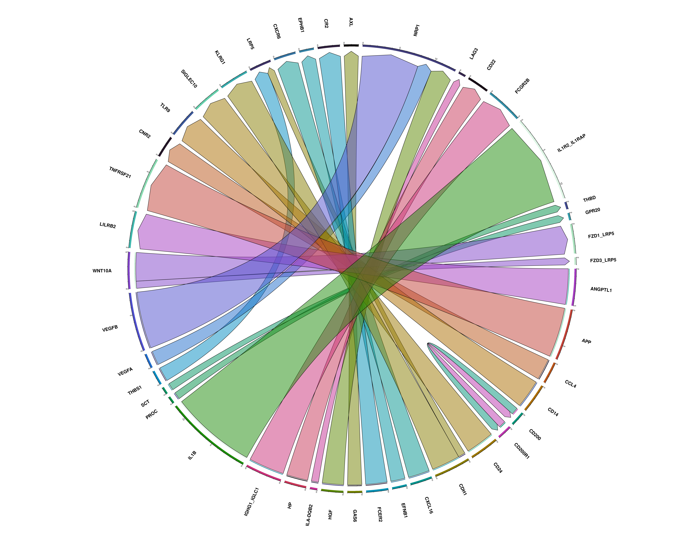
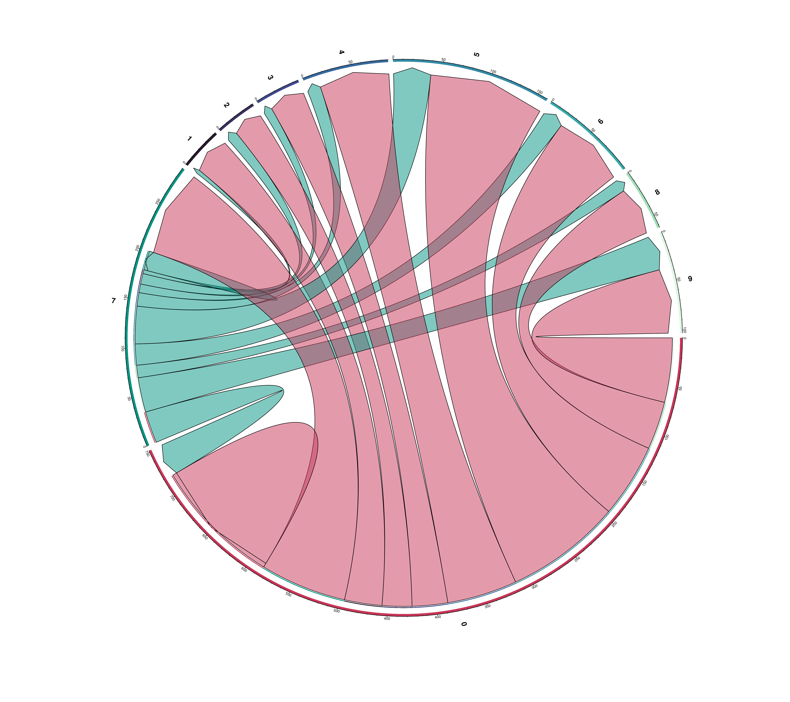
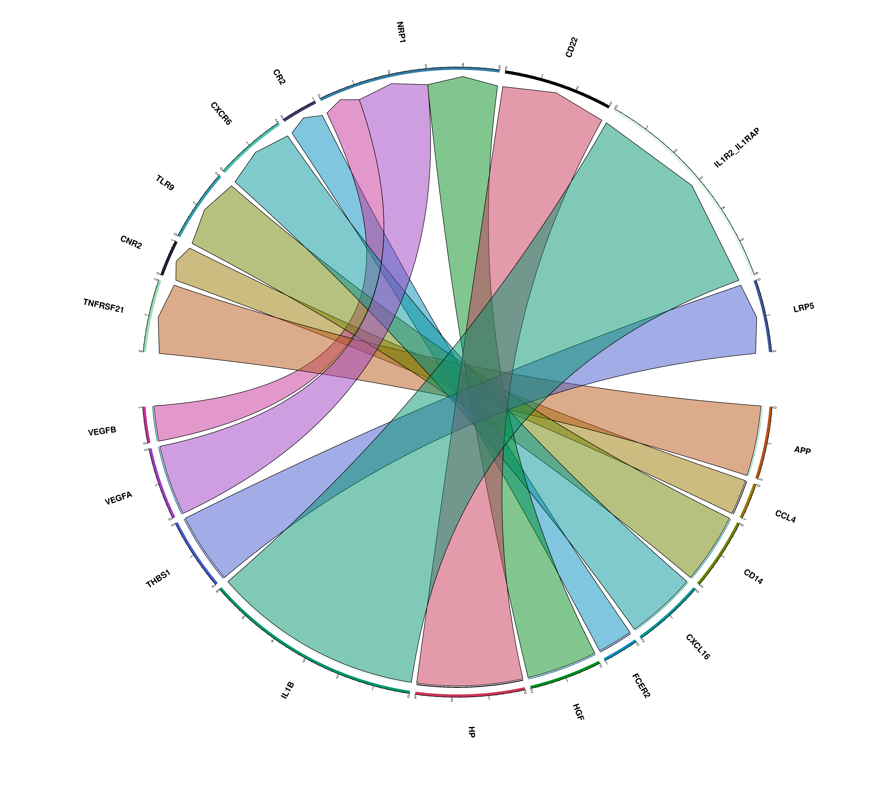

# Ligand-Receptor analysis

:::: {.warningbox .warning data-latex="warning"}

Due to CRAN policies, this function could not make it to the **official release** and is only available in the **development release** of **SCpubr**.
Find how to install it [**here**](https://github.com/enblacar/SCpubr/releases/tag/v1.0.1-dev-stable).

Once the package becomes available on CRAN/Bioconductor, the function will be integrated in the official release.

::::


```{r echo = F}
sample <- readRDS("/b06x-isilon/b06x-g/G703/eblanco/projects/test_SC_datasets/sc_dataset.rds")
liana_output <- readRDS("/b06x-isilon/b06x-g/G703/eblanco/projects/test_SC_datasets/liana_cellphoneDB.rds")
```

One very interesting analysis that can be carried out is **Ligand-Receptor analysis**. This allows to compute whether specific clusters interact with each other based on the co-expression of a ligand and its receptor in the respective clusters. The interactions are retrieved from different databases and a plethora of tools have been released to tackle this analysis. One of them is [liana](https://saezlab.github.io/liana/index.html), which is a framework that allows to run and **integrate** the results of several tools, providing a meta-analysis of the co-expression of ligand-receptor pairs. `SCpubr` makes use of `liana` and has its analysis and visualization integrated in the `SCpubr::do_LigandReceptorPlot()` function. 

## Basic usage
By default, the user has to run `liana` on their own and provide the resulting output as input for the function. The following code would produces the object that `SCpubr::do_LigandReceptorPlot()` expects as input:

```{r eval = F}
liana_output <- liana::liana_wrap(sce = sample,
                                  method = c("natmi", "connectome", "logfc", "sca", "cellphonedb"),
                                  idents_col = NULL,
                                  verbose = FALSE,
                                  assay = "SCT")
```

It is very important to note that `liana_output` has to contain the five different methods. This is a design choice. The output looks like:
```{r, fig.cap = "SCpubr do_LigandReceptorPlot default output.", fig.width=20, fig.height=10}
# Ligand Receptor analysis plot.
p <- SCpubr::do_LigandReceptorPlot(liana_output = liana_output)
p
```

## Increase the top significant interactions plotted
By default, top 25 unique, most significant interactions are retrieved and plotted. However, this can be changed by using `top_interactions`. Also, clusters that have no interactions, both as source and target, will be removed.:

```{r, fig.cap = "SCpubr do_LigandReceptorPlot default output with extra interactions.", fig.width=20, fig.height=20}
# Ligand Receptor analysis plot with extra interactions.
p <- SCpubr::do_LigandReceptorPlot(liana_output = liana_output,
                                   top_interactions = 50)
p
```

## Add or remove missing source-target combinations
Depending on the value we select for `top_interactions`, we might find out that there are specific source-target combinations for which we have no interactions at all. These show up in the resulting dotplot as empty columns. This is a design choice, as **SCpubr** brings these combinations back as NA values, thus making the different panels in the dotplot easier to read. However, with a small number of interactions, this might result in a very empty dotplot. Also, if we have many different sources, the plot can also become very long. 

In cases like these, we might rather go for only the relevant columns. We can toggle on/off this behaviour by using ``: 

```{r, fig.cap = "SCpubr do_LigandReceptorPlot with and without missing LR combinations.", fig.width=20, fig.height=20}
# Add missing LR combinations.
p1 <- SCpubr::do_LigandReceptorPlot(liana_output = liana_output,
                                    add_missing_LR_combinations = TRUE)

# Restrict the results to only the LR combinations that have a value.
p2 <- SCpubr::do_LigandReceptorPlot(liana_output = liana_output,
                                    add_missing_LR_combinations = FALSE)
p <- p1 /p2
p
```

## Modify the size of dots
Size of dots can be modified with `dot.size`:

```{r, fig.cap = "SCpubr do_LigandReceptorPlot with increased dot size.", fig.width=30, fig.height=10}
# Ligand Receptor analysis plot with increased dot size.
p <- SCpubr::do_LigandReceptorPlot(liana_output = liana_output,
                                   dot.size = 2)
p
```

## Toggle grid lines
One can also draw some grid lines. This is specially useful when the plot gets too big. This can be achieved by using `plot.grid = TRUE/FALSE`. The grid lines can be controlled using `grid.type` and the color with `grid.color`: 

```{r, fig.cap = "SCpubr do_LigandReceptorPlot with grid lines.", fig.width=20, fig.height=10}
# Ligand Receptor analysis plot with grid.
p <- SCpubr::do_LigandReceptorPlot(liana_output = liana_output,
                                   grid.color = "steelblue")
p
```


## Invert axis
For the cases in which one want to plot a lot of interactions, the plot can be flipped with `flip = TRUE`. X axis labels can be rotated with `x_labels_angle`, providing either 0, 45 or 90 degrees and strip text can be also rotated with `rotate_strip_text = TRUE`.

```{r, fig.cap = "SCpubr do_LigandReceptorPlot with inverted axes.", fig.width=20, fig.height=20}
# Ligand Receptor analysis plot with inverted axes.
p <- SCpubr::do_LigandReceptorPlot(liana_output = liana_output,
                                   flip = TRUE, 
                                   x_labels_angle = 90,
                                   rotate_strip_text = TRUE)
p
```

## Split the plot by ligand or receptor complex
Furthermore, the plot can be also further divided by grouping the interactions by common ligand or receptor complex. This can be achieved using `split.by` parameter.:
```{r, fig.cap = "SCpubr do_LigandReceptorPlot split by ligand.complex.", fig.width=20, fig.height=10}
# Ligand Receptor analysis plot grouped by ligand.complex.
p <- SCpubr::do_LigandReceptorPlot(liana_output = liana_output,
                                   plot.grid = TRUE,
                                   grid.color = "grey90",
                                   grid.type = "dotted",
                                   x_labels_angle = 90,
                                   rotate_strip_text = TRUE,
                                   split.by = "ligand.complex")
p
```

```{r, fig.cap = "SCpubr do_LigandReceptorPlot split by receptor.complex.", fig.width=20, fig.height=10}
# Ligand Receptor analysis plot grouped by ligand.complex.
p <- SCpubr::do_LigandReceptorPlot(liana_output = liana_output,
                                   split.by = "receptor.complex")
p
```

## Restrict the plot to given source and/or targets
Finally, one can also restrict the output to given source and target clusters. This can be achieved by provided the desired identities to `keep_source` and `keep_target`:

```{r, fig.cap = "SCpubr do_LigandReceptorPlot with filtered source and targets.", fig.width=10, fig.height=10}
# Ligand Receptor analysis plot with inverted axes with filtered source and targets.
p <- SCpubr::do_LigandReceptorPlot(liana_output = liana_output,
                                   flip = FALSE, 
                                   keep_source = c("0", "3", "9"),
                                   keep_target = c("3", "4", "9"))
p
```

## Compute chord diagrams of the interactions

Another supplementary visualizations that one can do with the results of liana is to visualize:
- The total number of significant interactions between each pair of clusters. 
- The number of interactions between the `top_interactions` ligand-receptor pairs. 

This can be achieved by providing `compute_ChordDiagrams = TRUE`. This will return a list with the dot plot and chord diagrams.


```{r, eval = FALSE}
# Chord diagram of the total significant interactions from each cluster and all the rest.
out <- SCpubr::do_LigandReceptorPlot(liana_output = liana_output,
                                     top_interactions = 25,
                                     compute_ChordDiagrams = TRUE)
out$chord_total_interactions
```
<span class="border-0"></span>

```{r, eval = FALSE}
# Chord diagram of the total ligand-receptor interactions from each cluster and all the rest.
out$chord_ligand_receptor
```
<span class="border-0"></span>

However, the plot can become quite messy. For this, it becomes more interesting to use in combination of `keep_source` or `keep_target` parameters:

```{r, eval = FALSE}
# Chord diagram of the total significant interactions from each cluster and all the rest.
out <- SCpubr::do_LigandReceptorPlot(liana_output = liana_output,
                                     top_interactions = 25,
                                     keep_source = c("0", "7"),
                                     compute_ChordDiagrams = TRUE)
out$chord_total_interactions
```
<span class="border-0"></span>

```{r, eval = FALSE}
# Chord diagram of the total ligand-receptor interactions from each cluster and all the rest.
out$chord_ligand_receptor
```
<span class="border-0"></span>

## Avoid generating a `omnipath-log` folder

If this folder appears in your tree structure, consider applying the hotfix stated [here](https://github.com/saezlab/liana/issues/61#issuecomment-1271589284). 
