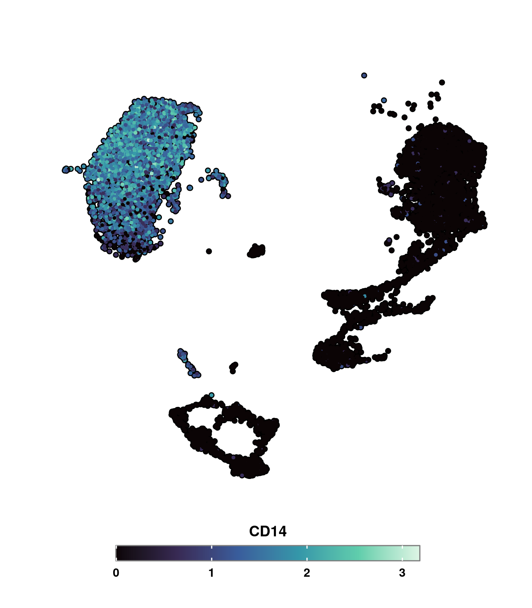

# Feature plots 
Another broadly used function in `Seurat` is `Seurat::FeaturePlot()`. It is basically the counterpart of `Seurat::DimPlot()` which instead of coloring the cells based on a categorical color scale, it uses a continuous one, according to a variable provided by the user. This can range from gene expression, to metadata variables such as the number of genes, or even values such as PC_1. This is how it looks, plotting the number of UMIs:


## Basic usage

```r
p <- Seurat::FeaturePlot(sample, 
                         features = "nCount_RNA")
p
```

<div class="figure" style="text-align: center">

<p class="caption">(\#fig:unnamed-chunk-2)Seurat FeaturePlot</p>
</div>
First thing that stands out, it that the color scale could be changed to one with two very opposite ends, so that identifying regions with low and high UMIs become an easier task. Apart from that, we want apply the same treatment as in `SCpubr::do_DimPlot()`: 


```r
p <- Seurat::FeaturePlot(sample, 
                         features = "nCount_RNA") + 
     Seurat::NoAxes() + 
     viridis::scale_color_viridis()
p
```

<div class="figure" style="text-align: center">

<p class="caption">(\#fig:unnamed-chunk-3)Seurat FeaturePlot, with new color scale and general modifications</p>
</div>

This way, we can observe that most of the clusters have a really similar number of UMIs, despite selected ones which have up to 4 times more. These could very well be doublets. This is `SCpubr::do_FeaturePlot()` variation:


```r
p <- SCpubr::do_FeaturePlot(sample = sample, 
                            features = "nCount_RNA", 
                            plot.title = "Number of UMIs")
p
```

<div class="figure" style="text-align: center">

<p class="caption">(\#fig:unnamed-chunk-4)SCpubr FeaturePlot, with minor modifications</p>
</div>

By default, `SCpubr` enlarges the dots a bit and makes the legend bold, to better stand out. Even though axes are removed from UMAP reductions, the title for the axes is kept for any other reduction used. The same is applied for UMAP if the default dimension order is altered.


```r
p1 <- SCpubr::do_FeaturePlot(sample = sample, 
                             features = "CD14",
                             plot.title = "My awesome SC data set",
                             reduction = "pca")
p2 <- SCpubr::do_FeaturePlot(sample = sample, 
                             features = "CD14",
                             plot.title = "My awesome SC data set",
                             dims = c(2, 1))
p1 | p2
```

<div class="figure" style="text-align: center">

<p class="caption">(\#fig:unnamed-chunk-5)SCpubr Feature with PCA embedding showing axes titles.</p>
</div>

## Multiple features

`SCpubr::do_FeaturePlot()` can tackle multiple queries at the same time. Plots can be rearranged as desired with `ncol` parameter:


```r
p <- SCpubr::do_FeaturePlot(sample, features = c("nCount_RNA", 
                                                 "nFeature_RNA", 
                                                 "percent.mt", 
                                                 "CD14"), 
                            plot.title = "My very important features", 
                            ncol = 2)
p
```

<div class="figure" style="text-align: center">

<p class="caption">(\#fig:unnamed-chunk-6)SCpubr FeaturePlot, with 4 features and 2 columns</p>
</div>

With multiple queries, using `plot.title` parameter actually adds a general title to all plots. If one wants to modify the title of each plot independently, a vector **of the same length as the number of features** needs to be provided to `individual.titles` parameter. In case a title does not need to be changed, use `NA` instead.


```r
p <- SCpubr::do_FeaturePlot(sample = sample,
                            features = c("nCount_RNA",
                                         "nFeature_RNA",
                                         "percent.mt",
                                         "CD14"),
                            plot.title = "My very important features",
                            individual.titles = c("Plot A",
                                                  "Plot_B",
                                                  NA,
                                                  "Plot_D"),
                            ncol = 2)
p
```

<div class="figure" style="text-align: center">

<p class="caption">(\#fig:unnamed-chunk-7)SCpubr FeaturePlot, with individual modified titles</p>
</div>

## Working with subsets of cells

One of the things that can be misleading, is that it could be the case that a very specific subset of cells are driving the ends of the color scales. Let's say that we have identified that clusters 2, 5, and 8 are responsible of this behavior. We would like to have plot the values without taking those cells into consideration. The very first thing that comes to mind is, indeed, removing the cells completely, resulting in the following:


```r
cells.plot <- colnames(sample[, !(sample$seurat_clusters %in% c("2", "5", "8"))])
p <- SCpubr::do_FeaturePlot(sample[, cells.plot], 
                            features = c("CD14"), 
                            plot.title = "My very important features")
p
```

<div class="figure" style="text-align: center">

<p class="caption">(\#fig:unnamed-chunk-8)SCpubr FeaturePlot, removing cells from clusters 2, 5 and 8</p>
</div>

However, this falls back to the same problem as with `Seurat::DimPlot` with the `split.by` parameter. We lose the overall context of where the cells are. This is taken care by in `SCpubr::do_FeaturePlot()`, when using the `cells.highlight` parameter:


```r
cells.plot <- colnames(sample[, !(sample$seurat_clusters %in% c("2", "5", "8"))])
p <- SCpubr::do_FeaturePlot(sample = sample, 
                            cells.highlight = cells.plot, 
                            features = c("CD14"), 
                            plot.title = "My very important features")
p
```

<div class="figure" style="text-align: center">

<p class="caption">(\#fig:unnamed-chunk-9)SCpubr FeaturePlot, masking cells from clusters 2, 5 and 8</p>
</div>
This way, by adding the cells back and modifying the legend, we accomplish the desired effect. Furthermore, `SCpubr::do_FeaturePlot()` also accepts a vector of the identities to plot, as long as they are part of `levels(seurat_object)`. This can be achieved by using the `idents.highlight` instead.


```r

p <- SCpubr::do_FeaturePlot(sample = sample, 
                            idents.highlight = levels(sample)[!(levels(sample) %in% c("2", "5", "8"))], 
                            features = c("CD14"), 
                            plot.title = "My very important features")
p
```

<div class="figure" style="text-align: center">

<p class="caption">(\#fig:unnamed-chunk-10)SCpubr FeaturePlot, masking cells from clusters 2, 5 and 8 using idents.highlight</p>
</div>
## Splitting the FeaturePlot by a variable
In some cases, we want to visualize a given feature, let's say, the expression of `LYN` across another variable, for instance `seurat_clusters`. This can be achieved easily in `Seurat` by using the `split.by` parameter. For the sake of representation, let's reduce the number of clusters.


```r
# Group clusters.
sample$new_clusters <- as.character(sample$seurat_clusters)
sample$new_clusters[sample$new_clusters %in% c("0", "1", "2", "3")] <- "Cluster 1"
sample$new_clusters[sample$new_clusters %in% c("4", "5", "6")] <- "Cluster 2"
sample$new_clusters[sample$new_clusters %in% c("7", "8", "9")] <- "Cluster 3"

p <- Seurat::FeaturePlot(sample, 
                         features = "LYN", 
                         split.by = "new_clusters")
p
```

<div class="figure" style="text-align: center">

<p class="caption">(\#fig:unnamed-chunk-11)Seurat FeaturePlot split by clusters.</p>
</div>
Apart from the general aesthetic discrepancies mentioned before, there are two main aspects missing. First, is the overall layout of the UMAP embedding. Being able to correctly locate the clusters is really important. Secondly, knowing that, by default, the color scale is shared across all the plots (achieved by using `keep.scale = "feature"`), we would like to know up to which value this color scale reaches. In this two aspects is where `SCpubr::do_FeaturePlot()` delves into: 


```r
p <- SCpubr::do_FeaturePlot(sample = sample, 
                            features = "LYN", 
                            split.by = "new_clusters")
p
```

<div class="figure" style="text-align: center">

<p class="caption">(\#fig:unnamed-chunk-12)SCpubr FeaturePlot split by clusters.</p>
</div>

This way, we are able to achieve a better understandable plot. Please note that this has been implemented for `keep.scale = "feature"`. Providing other options is not advisable. Furthermore, we can query multiple features, them being stacked by the different entities in `split.by`. The number of columns is predetermined to the number of entities and can not be modified. In this example, we provide each of the three possible examples of features:

- `LYN` is a gene located in the rownames of the count matrix (`rownames(sample)``).
- `nCount_RNA` is a metadata variable located in `colnames(sample@meta.data)`.
- `PC_1` is a column of a dimensional reduction embedding, located in `colnames(sample@reductions[["pca"]][[]])`


```r
p <- SCpubr::do_FeaturePlot(sample, 
                            features = c("LYN", "nCount_RNA", "PC_1"), 
                            split.by = "new_clusters")
p
```

<div class="figure" style="text-align: center">

<p class="caption">(\#fig:unnamed-chunk-13)SCpubr FeaturePlot split by clusters using multiple features.</p>
</div>

With `SCpubr::do_FeaturePlot()` we can even subset the previous plot to any identities in `split.by` we are particularly interested in. The color scale also limits itself to contain only the values in the selected identities. This can be achieved by provided a vector with the identities to `split.by.idents` parameter.


```r
p <- SCpubr::do_FeaturePlot(sample, 
                            features = c("LYN", "nCount_RNA", "PC_1"), 
                            split.by = "seurat_clusters", 
                            split.by.idents = c("2", "5"))
p
```

<div class="figure" style="text-align: center">

<p class="caption">(\#fig:unnamed-chunk-14)SCpubr FeaturePlot split by clusters using multiple features and selected identities.</p>
</div>

## Modify color maps
It is possible in `SCpubr::do_FeaturePlot()` to also change the color map of the plot to one of the eight possible ones defined in [viridis](https://cran.r-project.org/web/packages/viridis/vignettes/intro-to-viridis.html). This is achieved by using `viridis_color_map` parameter and the color map name or code (capital letter). Options are:

- A - magma color map.
- B - inferno color map.
- C - plasma color map.
- D - viridis color map.
- E - cividis color map.
- F - rocket color map.
- G - mako color map.
- H - turbo  color map.


```r
p1 <- SCpubr::do_FeaturePlot(sample = sample, features = "CD14", viridis_color_map = "A", plot.title = "Magma")
p2 <- SCpubr::do_FeaturePlot(sample = sample, features = "CD14", viridis_color_map = "B", plot.title = "Inferno")
p3 <- SCpubr::do_FeaturePlot(sample = sample, features = "CD14", viridis_color_map = "C", plot.title = "Plasma")
p4 <- SCpubr::do_FeaturePlot(sample = sample, features = "CD14", viridis_color_map = "D", plot.title = "Viridis")
p5 <- SCpubr::do_FeaturePlot(sample = sample, features = "CD14", viridis_color_map = "E", plot.title = "Cividis")
p6 <- SCpubr::do_FeaturePlot(sample = sample, features = "CD14", viridis_color_map = "F", plot.title = "Rocket")
p7 <- SCpubr::do_FeaturePlot(sample = sample, features = "CD14", viridis_color_map = "G", plot.title = "Mako")
p8 <- SCpubr::do_FeaturePlot(sample = sample, features = "CD14", viridis_color_map = "H", plot.title = "Turbo")

p <- patchwork::wrap_plots(list(p1, p2, p3, p4, p5, p6, p7, p8), ncol = 2, byrow = TRUE)
p
```

<div class="figure" style="text-align: center">

<p class="caption">(\#fig:unnamed-chunk-15)SCpubr FeaturePlot modifying viridis color maps.</p>
</div>
Here, we do not recommend the use of `turbo` with Feature plots, as this continuous scale goes through many different colors and, therefore, makes it harder for interpretation. 
