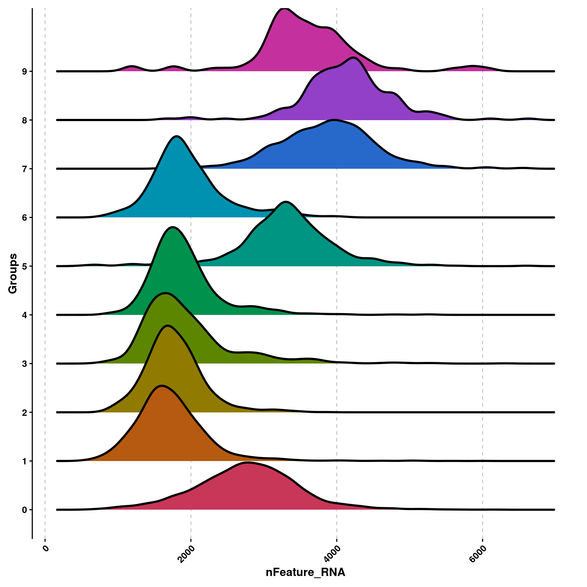
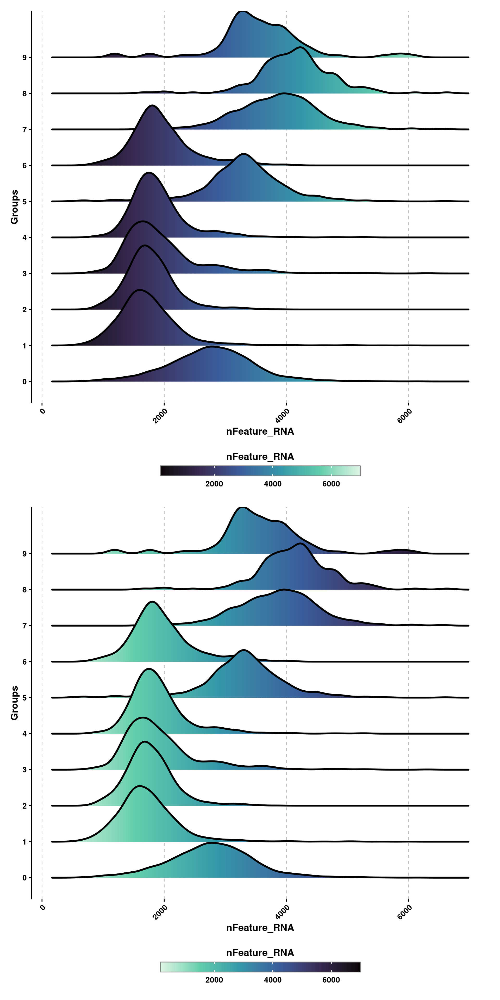
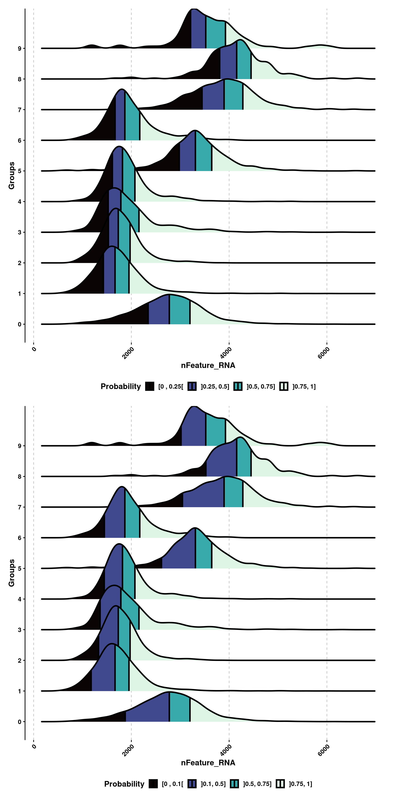
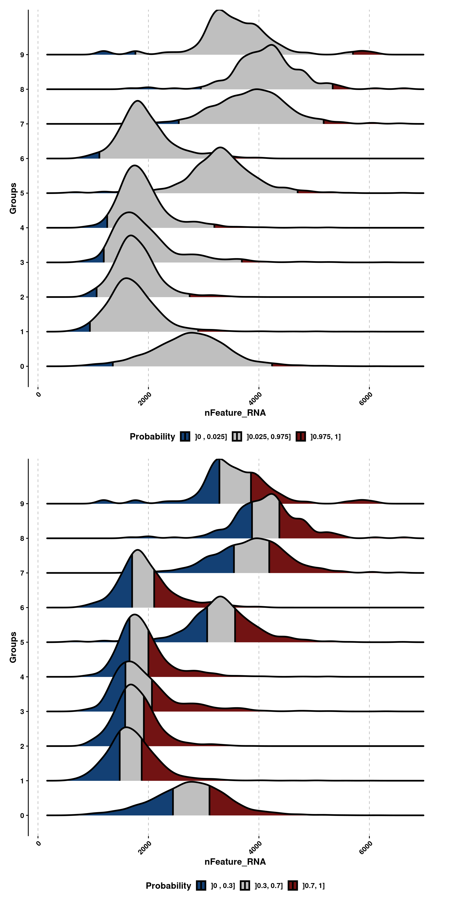
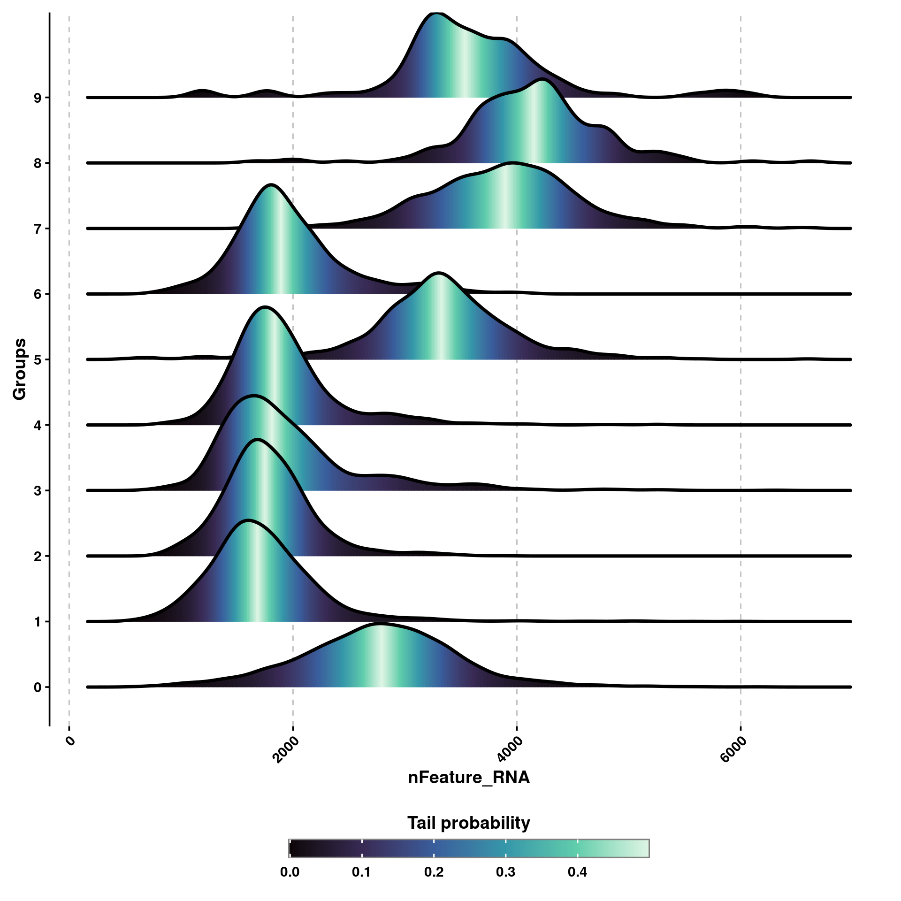

# Ridge plots

Ridge plots are a very interesting way to display multiple *violin plots* together. The main idea of this type of visualization is to observe shifts in the distribution of a given variable across several groups. This can be accomplished using \link[ggridges]{https://cran.r-project.org/web/packages/ggridges/vignettes/introduction.html} package.

The most basic ridge plot can be computed as:


```r
# Compute the most basic ridge plot.
p <- SCpubr::do_RidgePlot(sample = sample,
                          feature = "nFeature_RNA")
p
```

<div class="figure" style="text-align: center">

<p class="caption">(\#fig:unnamed-chunk-2)Basic ridge plot</p>
</div>

By default, the groups plotted are the current identities in the sample, but this can be changed by using `group.by`. One can also color the ridges based on the continuous values being represented, using `continuous_scale = TRUE`. The direction of the color scale can be controlled using `viridis_direction` :


```r
# Use continuous color scale.
p1 <- SCpubr::do_RidgePlot(sample = sample,
                           feature = "nFeature_RNA",
                           continuous_scale = TRUE,
                           viridis_direction = 1)

p2 <- SCpubr::do_RidgePlot(sample = sample,
                           feature = "nFeature_RNA",
                           continuous_scale = TRUE,
                           viridis_direction = -1)

p <- p1 / p2
p
```

<div class="figure" style="text-align: center">

<p class="caption">(\#fig:unnamed-chunk-3)Basic ridge plot colored using the continuous scale.</p>
</div>


## Plot quantiles of the distribution.

One can also draw quantiles of the distribution for each of the groups. For this, we need to set up the scale to continuous. Also, we can modify the quantiles by using `quantiles` parameter:  


```r
# Draw quantiles of the distribution.
p1 <- SCpubr::do_RidgePlot(sample = sample,
                           feature = "nFeature_RNA",
                           continuous_scale = TRUE,
                           compute_quantiles = TRUE,
                           compute_custom_quantiles = TRUE)

p2 <- SCpubr::do_RidgePlot(sample = sample,
                           feature = "nFeature_RNA",
                           continuous_scale = TRUE,
                           compute_quantiles = TRUE,
                           compute_custom_quantiles = TRUE,
                           quantiles = c(0.1, 0.5, 0.75))

p <- p1 / p2
p
```

<div class="figure" style="text-align: center">

<p class="caption">(\#fig:unnamed-chunk-4)RidgePlots with quantiles.</p>
</div>

## Compute probability tails

One can draw probability tails of the distribution by using `compute_distribution_tails` and `prob_tails`.


```r
# Draw probability tails.
p1 <- SCpubr::do_RidgePlot(sample = sample,
                           feature = "nFeature_RNA",
                           continuous_scale = TRUE,
                           compute_quantiles = TRUE,
                           compute_distribution_tails = TRUE)

p2 <- SCpubr::do_RidgePlot(sample = sample,
                           feature = "nFeature_RNA",
                           continuous_scale = TRUE,
                           compute_quantiles = TRUE,
                           compute_distribution_tails = TRUE,
                           prob_tails = 0.3)

p <- p1 / p2
p
```

<div class="figure" style="text-align: center">

<p class="caption">(\#fig:unnamed-chunk-5)RidgePlots with probability tails.</p>
</div>

## Compute probability densities

One can also display the probability densities of the distributions by using :


```r
# Draw probability tails.
p <- SCpubr::do_RidgePlot(sample = sample,
                          feature = "nFeature_RNA",
                          continuous_scale = TRUE,
                          compute_quantiles = TRUE,
                          color_by_probabilities = TRUE)
p
```

<div class="figure" style="text-align: center">

<p class="caption">(\#fig:unnamed-chunk-6)RidgePlots with probability densities.</p>
</div>


