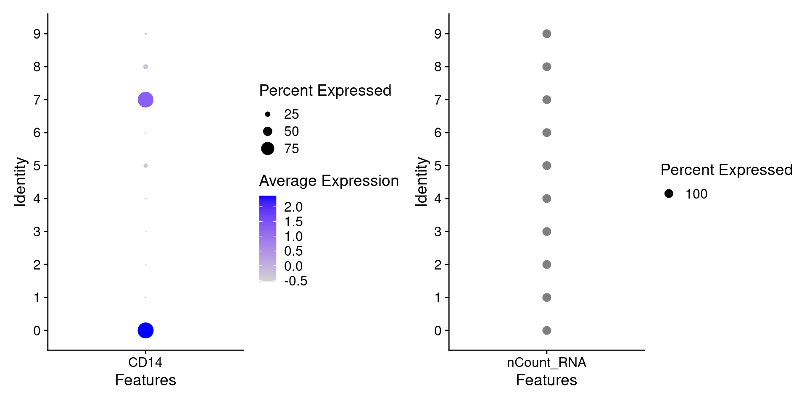
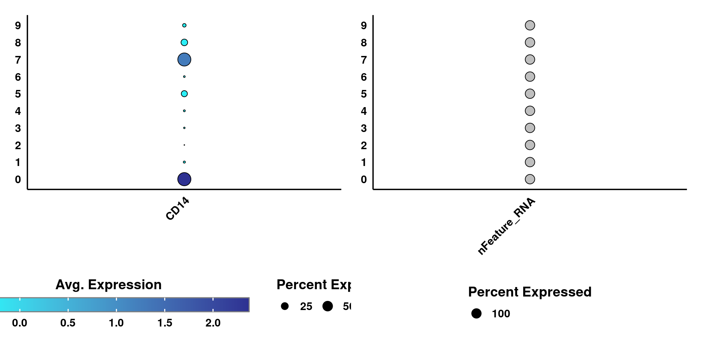
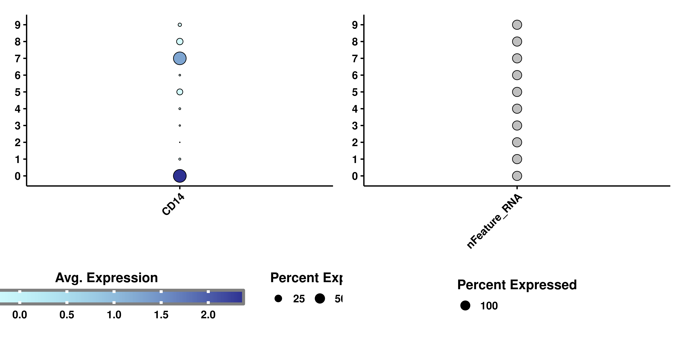
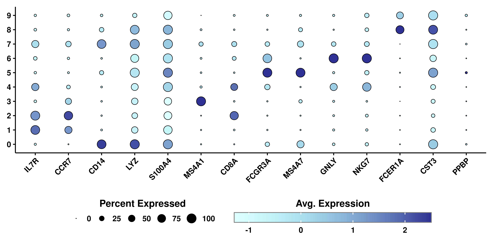
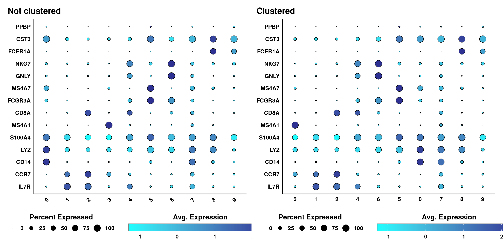

# Dot plots

Dot plots are a very nice data representation technique. It involves the use of two scales. One scale is color-based while the second one is size-based. In the context of `Seurat::DotPlot()`, these scales are pre-defined to contain the average expression values on the color scale and the percentage of cells within the group expressing the feature on the size, increasing it as this percentage grows bigger. It is heavily implied that the features need to be genes, otherwise the color scale will be lost. This is the output from `Seurat`:


## Basic usage


```r
p1 <- Seurat::DotPlot(sample, 
                      features = "CD14")
p2 <- Seurat::DotPlot(sample, 
                      features = "nCount_RNA")
p <- p1 | p2
p
```

<div class="figure" style="text-align: center">

<p class="caption">(\#fig:unnamed-chunk-2)Seurat DotPlot</p>
</div>
As can be seen, if we try to plot other type of variables, the resulting plot will not contain a color scale. `SCpubr::do_DimPlot()` focuses on enhancing the overall appearance of the plots. Implementation using other types of features is not currently supported. This is how it looks using `SCpubr::do_DimPlot()`:


```r
p1 <- SCpubr::do_DotPlot(sample = sample, 
                         features = "CD14")
p2 <- SCpubr::do_DotPlot(sample = sample, 
                         features = "nFeature_RNA")
p <- p1 | p2
p
```

<div class="figure" style="text-align: center">

<p class="caption">(\#fig:unnamed-chunk-3)SCpubr DotPlot</p>
</div>

## Querying multiple features at once

The true power of this data visualization relies on querying multiple genes at once. Let's query the ones described in this [Seurat vignette](https://satijalab.org/seurat/articles/pbmc3k_tutorial.html#assigning-cell-type-identity-to-clusters-1):


```r
genes <- c("IL7R", "CCR7", "CD14", "LYZ", 
           "S100A4", "MS4A1", "CD8A", "FCGR3A", 
           "MS4A7", "GNLY", "NKG7", "FCER1A", 
           "CST3", "PPBP")
p <- SCpubr::do_DotPlot(sample = sample, 
                        features = genes)
p
```

<div class="figure" style="text-align: center">

<p class="caption">(\#fig:unnamed-chunk-4)SCpubr DotPlot using multiple genes</p>
</div>

Here, we can clearly distinguish which clusters are highly enriched in which given genes. This proves to be a very interesting way to query for cluster identities. It is highly dependent, though, on the accuracy of the selected genes for the queried dataset. If we actually provide the list of genes as a named list, we can facet the plot in the different list of genes provided:


```r
genes <- list("Naive CD4+ T" = c("IL7R", "CCR7"),
              "CD14+ Mono" = c("CD14", "LYZ"),
              "Memory CD4+" = c("S100A4"),
              "B" = c("MS4A1"),
              "CD8+ T" = c("CD8A"),
              "FCGR3A+ Mono" = c("FCGR3A", "MS4A7"),
              "NK" = c("GNLY", "NKG7"),
              "DC" = c("FCER1A", "CST3"),
              "Platelet" = c("PPBP"))
p <- SCpubr::do_DotPlot(sample = sample, 
                        features = genes)
p
```

<div class="figure" style="text-align: center">

<p class="caption">(\#fig:unnamed-chunk-5)SCpubr DotPlot using multiple genes</p>
</div>

## Clustering the identities

One really cool feature from `Seurat::DotPlot()` is that it lets you cluster the identities in the Y axis depending on how similar they are between them across the values on the X axis. This is achieved by using `cluster.idents = TRUE`, parameter also implemented in `SCpubr::do_DotPlot()`:


```r
genes <- list("Naive CD4+ T" = c("IL7R", "CCR7"),
              "CD14+ Mono" = c("CD14", "LYZ"),
              "Memory CD4+" = c("S100A4"),
              "B" = c("MS4A1"),
              "CD8+ T" = c("CD8A"),
              "FCGR3A+ Mono" = c("FCGR3A", "MS4A7"),
              "NK" = c("GNLY", "NKG7"),
              "DC" = c("FCER1A", "CST3"),
              "Platelet" = c("PPBP"))
p1 <- SCpubr::do_DotPlot(sample = sample, 
                         features = genes,
                         plot.title = "Not clustered")
p2 <- SCpubr::do_DotPlot(sample = sample, 
                         features = genes, 
                         cluster.idents = TRUE, 
                         plot.title = "Clustered")
p <- p1 / p2
p
```

<div class="figure" style="text-align: center">

<p class="caption">(\#fig:unnamed-chunk-6)SCpubr DotPlot using multiple genes and clustering the identities</p>
</div>

## Inverting the axes

In `SCpubr::do_DotPlot()`, we can also invert the axes, so that the groups are in the X axis and the genes in the Y axis. This is achieved by using `flip = TRUE`. Note, however, that this does not work when using a named list of genes as input, as it completely distort the way facets are computed. Given this, this combination of parameters is currently blocked by `SCpubr`.


```r
genes <- c("IL7R", "CCR7", "CD14", "LYZ", 
           "S100A4", "MS4A1", "CD8A", "FCGR3A", 
           "MS4A7", "GNLY", "NKG7", "FCER1A", 
           "CST3", "PPBP")
p1 <- SCpubr::do_DotPlot(sample = sample, 
                         features = genes, 
                         plot.title = "Not clustered", 
                         flip = TRUE)
p2 <- SCpubr::do_DotPlot(sample = sample, 
                         features = genes, 
                         cluster.idents = TRUE, 
                         plot.title = "Clustered", 
                         flip = TRUE,
                         rotate_x_axis_labels = FALSE)
p <- p1 | p2
p
```

<div class="figure" style="text-align: center">

<p class="caption">(\#fig:unnamed-chunk-7)SCpubr DotPlot using multiple genes and clustering the identities flipping axes</p>
</div>

