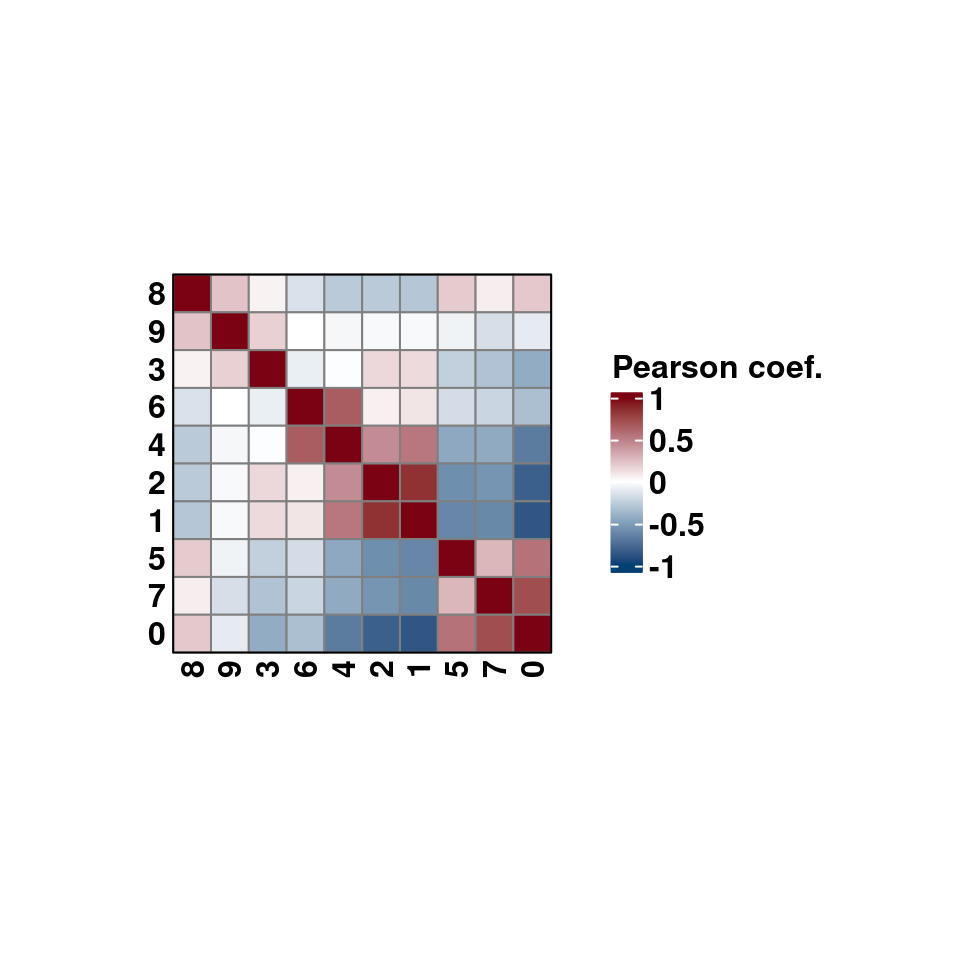
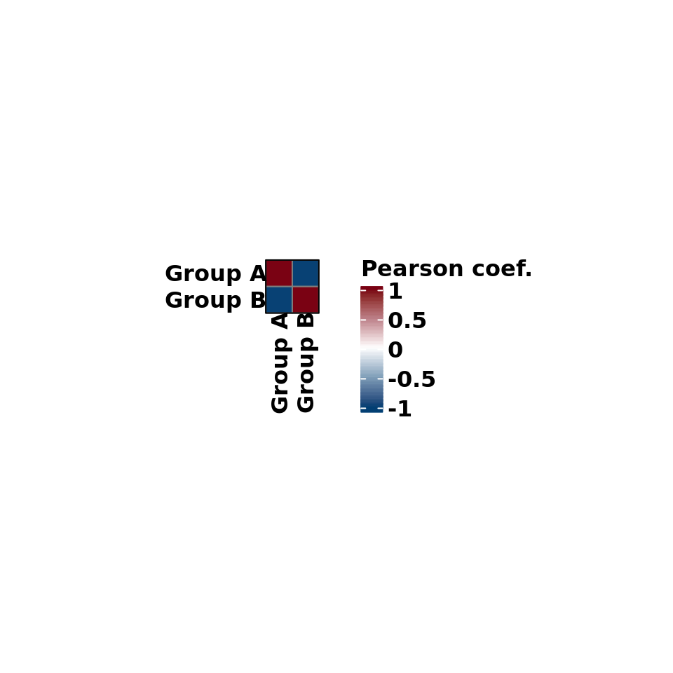
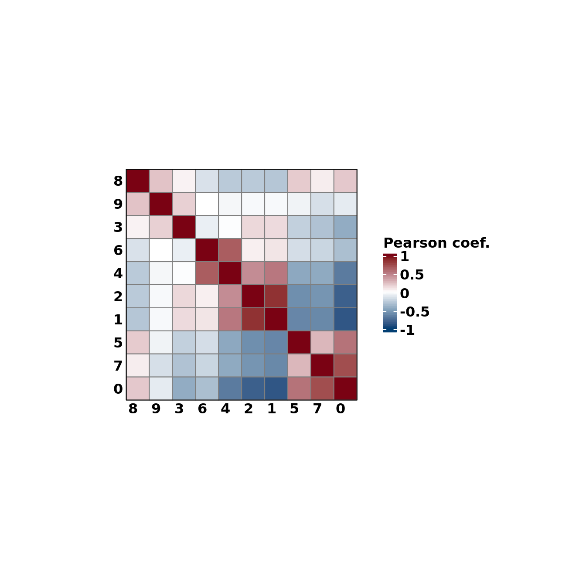

# Correlation matrix heatmaps

A common analysis to perform with your single cell data is to assess how much different subsets of your data are correlated between them. For this, correlation matrices are used, typically displayed as heatmaps. This is implemented in `SCpubr::do_CorrelationPlot()`. Right now, it only works for a single use case: computing the correlation matrix of the highly variable genes between the desired groups. Further use cases will be implemented in the future.

## Using Highly Variable Genes

(\#fig:unnamed-chunk-2)SCpubr::do_CorrelationPlot with default parameters.

By default, it computes the correlation over the current identities in the object. This can be changed by providing another metadata variable to `group.by`. 

(\#fig:unnamed-chunk-3)SCpubr::do_CorrelationPlot with custom grouping.

Axes labels can also be rotated.

(\#fig:unnamed-chunk-4)SCpubr::do_CorrelationPlot with rotated axis labels.

## Changing the color scale

Color scale can be modified using `colors.use` parameter.

(\#fig:unnamed-chunk-5)SCpubr::do_CorrelationPlot with rotated axis labels and modified color scale.

