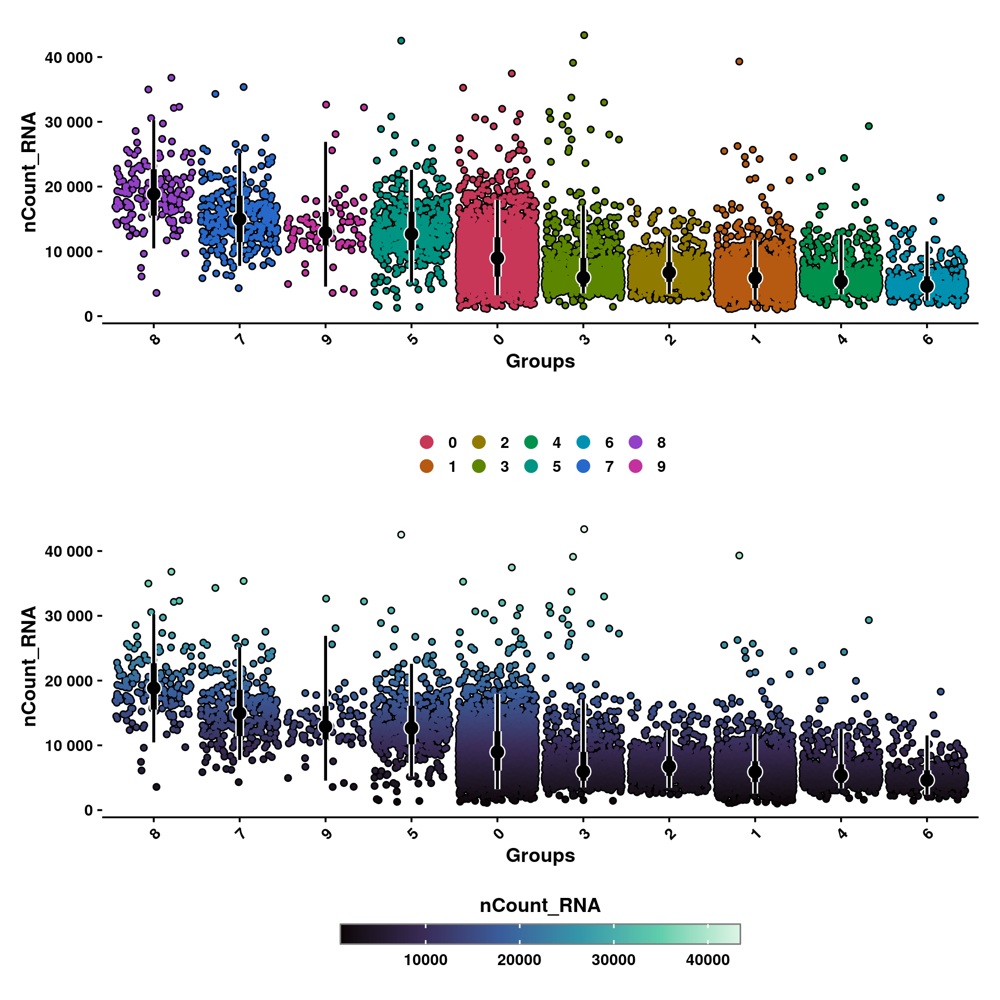
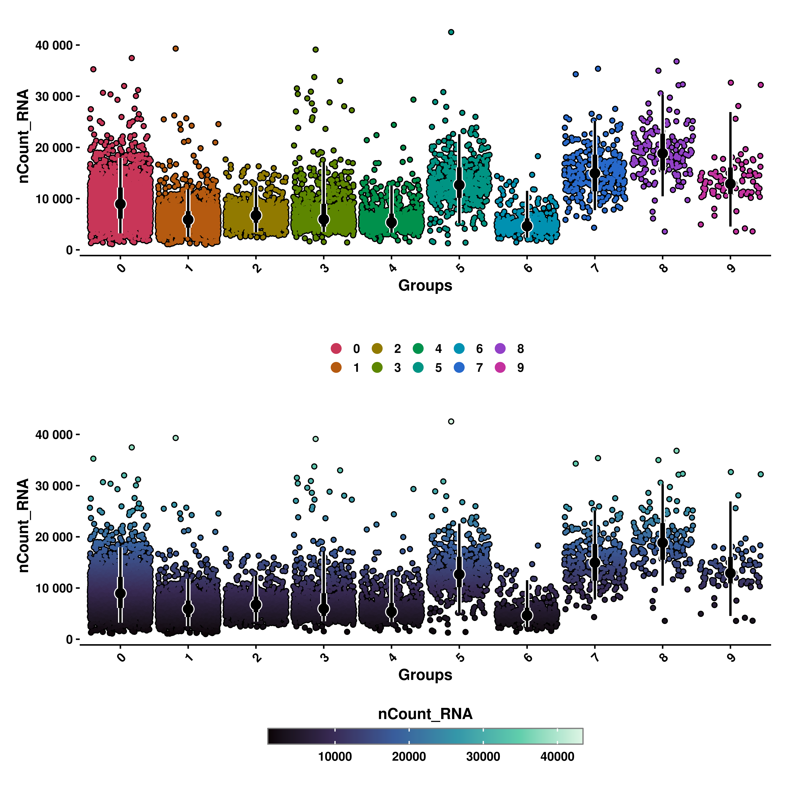
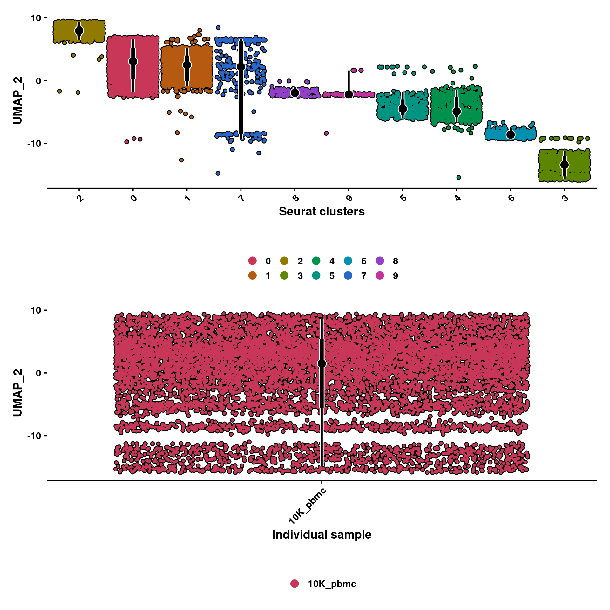
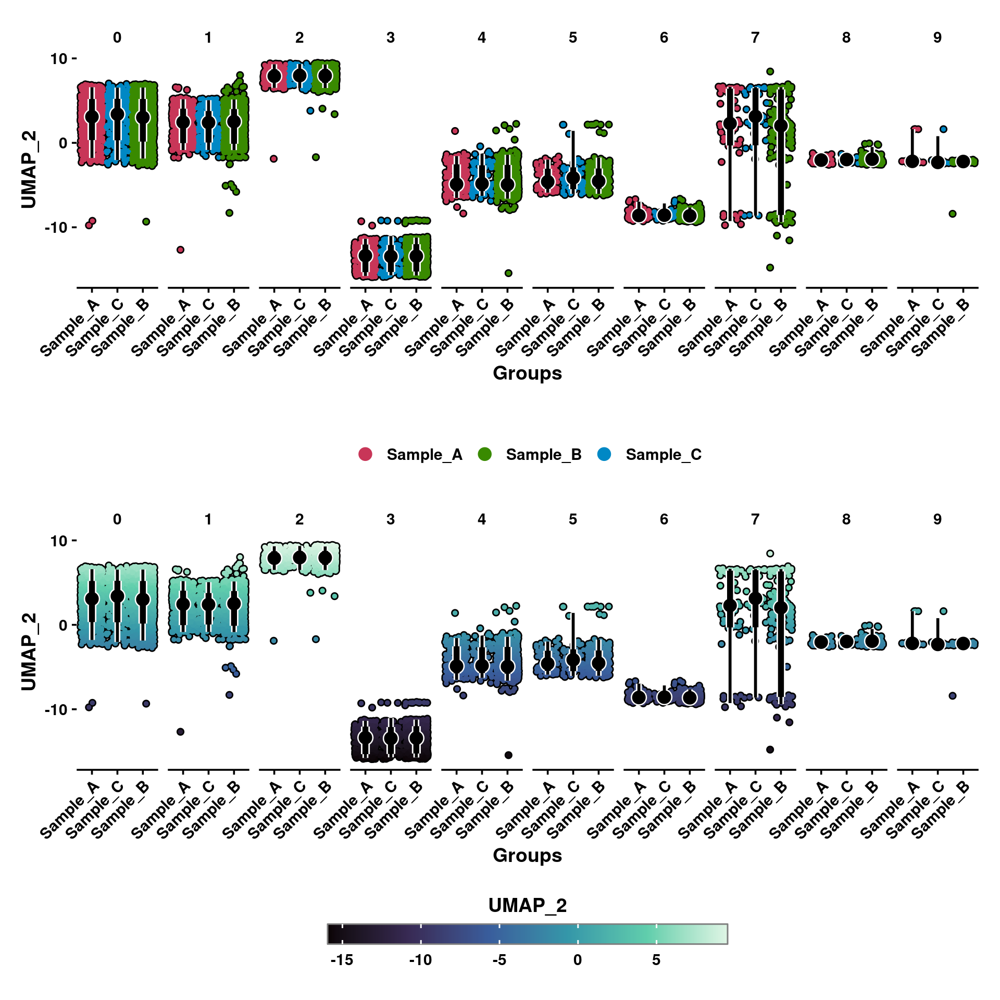
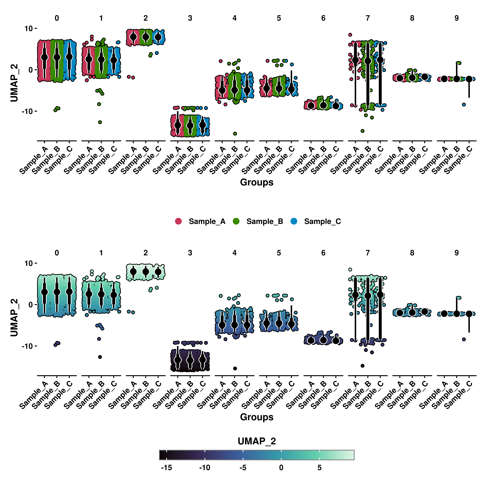
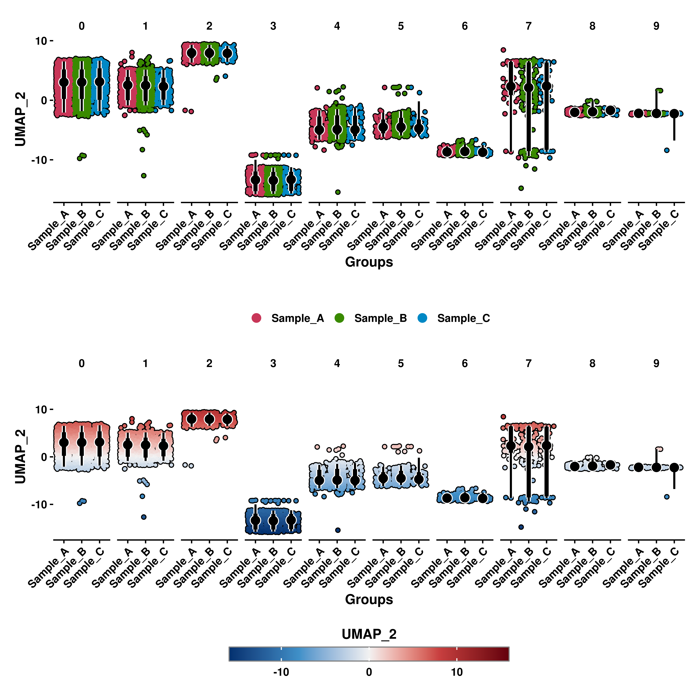
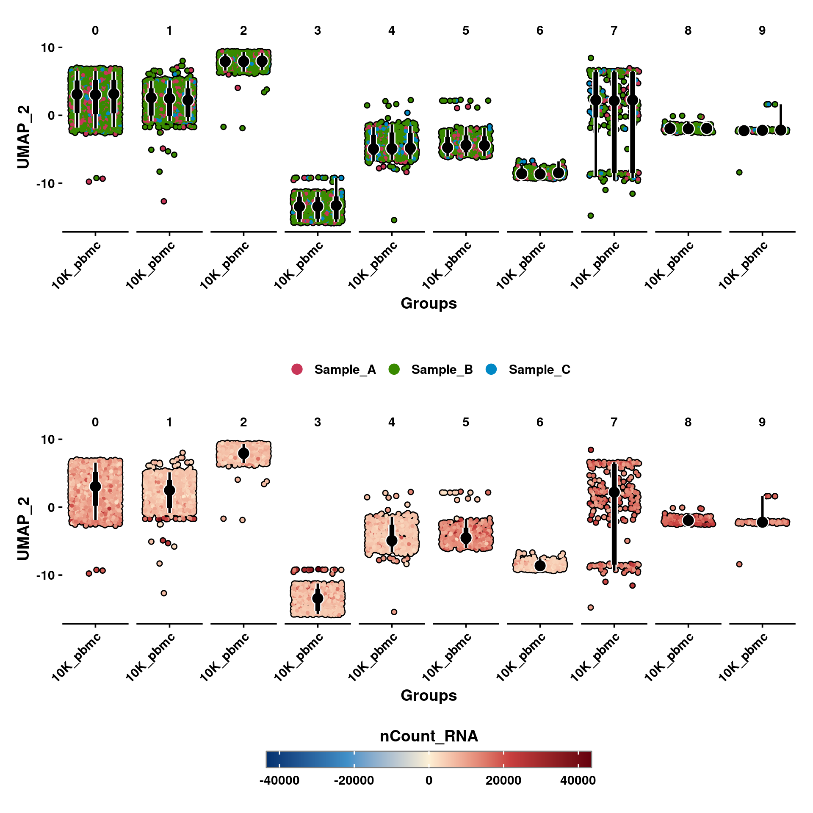
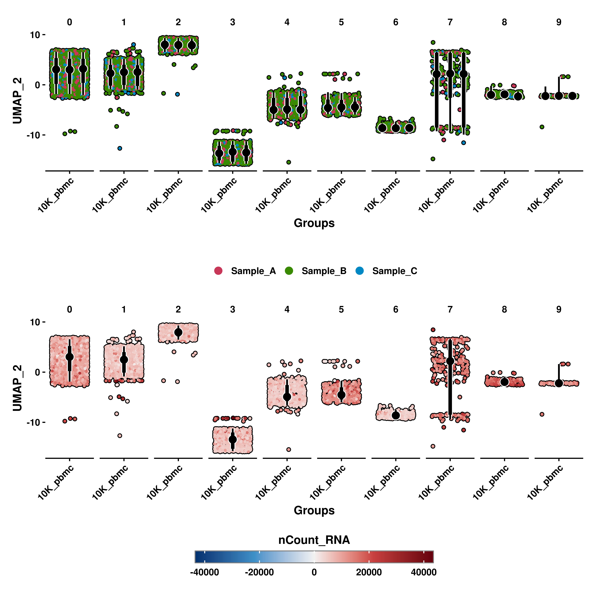

# Geyser plots

Geyser plots are a kind of scatter plots characterized by plotting a continuous variable on the Y axis and splitting the dots by a categorical variable on the X axis. This normally results in the dots collapsing on a single line along the Y axis, but with jittering they can spread out, depicting a shape that resemble that of a Geyser. Furthermore, to better understand the distribution of data along the Y axis, distribution intervals are plotted on top of the Geyser plots. The dot depitcs the median of the data, while the end of the thick and thin lines represent 66% and 95% of the data in the group, respectively. 

These plots are just an alternate way of representing what can be achieved with a violin plot. However, this version allows for a more aesthetic view while also allowing the user to further plot another extra variable on the dots, coloring with a continuous or a categorical scale. 


## Basic usage

The most basic version of this plot uses only the X and Y variables, while the color of the cells is assigned to either of the two. We can achieve this by using `SCpubr::do_GeyserPlot()` and stating the kind of color scale we want with `scale_type` (either continuous or categorical). 


```r
# Geyser plot with categorical color scale.
p1 <- SCpubr::do_GeyserPlot(sample = sample,
                            features = "nCount_RNA",
                            scale_type = "categorical")

# Geyser plot with continuous color scale.
p2 <- SCpubr::do_GeyserPlot(sample = sample,
                            features = "nCount_RNA",
                            scale_type = "continuous")


p <- p1 / p2
p
```

<div class="figure" style="text-align: center">

<p class="caption">(\#fig:unnamed-chunk-2)SCpubr do_GeyserPlot regular use.</p>
</div>

## Ordering by mean values
First thing that one notice, is that the geysers are ordered from highest to lowest mean values. This can be nullified by using `order_by_mean = FALSE`. In this case, the geysers will order based on alphabetical order or on the levels if the variable chosen is a factor. 


```r
# Geyser plot with categorical color scale without ordering by mean.
p1 <- SCpubr::do_GeyserPlot(sample = sample,
                            features = "nCount_RNA",
                            scale_type = "categorical",
                            order_by_mean = FALSE)

# Geyser plot with continuous color scale without ordering by mean.
p2 <- SCpubr::do_GeyserPlot(sample = sample,
                            features = "nCount_RNA",
                            scale_type = "continuous",
                            order_by_mean = FALSE)


p <- p1 / p2
p
```

<div class="figure" style="text-align: center">

<p class="caption">(\#fig:unnamed-chunk-3)SCpubr do_GeyserPlot without ordering by the mean.</p>
</div>

## Plotting symmetrical scales

Depending on the case, it might be the case in which we want to plot a continuous variable that spans both in positive and negative values. Although not necessary, there are cases in which this binary nature of the values has a biological meaning and we, therefore, assign two gradient of colors (typically blue for negative values and red for positive values) to better visualize this nature of the data. We can achieve this by using `enforce_symmetry = TRUE`.


```r
# Geyser plot with continuous color scale.
p1 <- SCpubr::do_GeyserPlot(sample = sample,
                            features = "UMAP_2",
                            scale_type = "continuous",
                            enforce_symmetry = FALSE)

# Geyser plot with continuous and symmetrical color scale.
p2 <- SCpubr::do_GeyserPlot(sample = sample,
                            features = "UMAP_2",
                            scale_type = "continuous",
                            enforce_symmetry = TRUE)


p <- p1 / p2
p
```

<div class="figure" style="text-align: center">

<p class="caption">(\#fig:unnamed-chunk-4)SCpubr do_GeyserPlot plotting a symmetrical scale.</p>
</div>

## Select the groups displayed on the X axis

Furhtermore, we can select the groups displayed on the X axis with `group.by` parameter. It defaults to the current identities in the sample if not provided. That is also the reason why the X axis title is called "Groups". The titles can be modified by usind `xlab` and `ylab`, respectively. 


```r
# Geyser plot with categorical color scale default X axis grouping.
p1 <- SCpubr::do_GeyserPlot(sample = sample,
                            features = "UMAP_2",
                            scale_type = "categorical",
                            group.by = NULL,
                            xlab = "Seurat clusters")

# Geyser plot with categorical color scale and custom grouping.
p2 <- SCpubr::do_GeyserPlot(sample = sample,
                            features = "UMAP_2",
                            scale_type = "categorical",
                            group.by = "orig.ident",
                            xlab = "Individual sample")


p <- p1 / p2
p
```

<div class="figure" style="text-align: center">

<p class="caption">(\#fig:unnamed-chunk-5)SCpubr do_GeyserPlot plotting different groups.</p>
</div>

## Split the plot by groups

Apart from selecting the grouping, we can effectively split the plot by another categorical variable. This can be achieved by using `split.by`.


```r
# We only have one value in orig.ident. Let's modify it so that it resembles a multi-sample Seurat object.
sample$modified_orig.ident <- sample(x = c("Sample_A", "Sample_B", "Sample_C"), 
                                     size = ncol(sample), 
                                     replace = T, 
                                     prob = c(0.2, 0.7, 0.1))

# Geyser plot with categorical color scale split by seurat clusters.
p1 <- SCpubr::do_GeyserPlot(sample = sample,
                            features = "UMAP_2",
                            scale_type = "categorical",
                            group.by = "modified_orig.ident",
                            split.by = "seurat_clusters")

# Geyser plot with continuous color scale split by seurat clusters.
p2 <- SCpubr::do_GeyserPlot(sample = sample,
                            features = "UMAP_2",
                            scale_type = "continuous",
                            group.by = "modified_orig.ident",
                            split.by = "seurat_clusters")


p <- p1 / p2
p
```

<div class="figure" style="text-align: center">

<p class="caption">(\#fig:unnamed-chunk-6)SCpubr do_GeyserPlot splitting by groups.</p>
</div>

## Rotating X axis labels
As with the example above, X axis labels might overlap one with another. This can be changed by using `rotate_x_axis_labels = FALSE`,


```r
# Geyser plot with categorical color scale split by seurat clusters rotating labels.
p1 <- SCpubr::do_GeyserPlot(sample = sample,
                            features = "UMAP_2",
                            scale_type = "categorical",
                            group.by = "modified_orig.ident",
                            split.by = "seurat_clusters",
                            rotate_x_axis_labels = FALSE)

# Geyser plot with continuous color scale split by seurat clusters rotating labels.
p2 <- SCpubr::do_GeyserPlot(sample = sample,
                            features = "UMAP_2",
                            scale_type = "continuous",
                            enforce_symmetry = TRUE,
                            group.by = "modified_orig.ident",
                            split.by = "seurat_clusters",
                            rotate_x_axis_labels = FALSE)


p <- p1 / p2
p
```

<div class="figure" style="text-align: center">

<p class="caption">(\#fig:unnamed-chunk-7)SCpubr do_GeyserPlot rotating X axis labels.</p>
</div>


## Adding a third variable

You might have noticed, that so far these plots effectively "waste" one axis: either the continuous color scale and the Y axis depict the same, or the X axis and the categorical color scale do it. For this we can add a third variable using `color.by` parameter.


```r
# Geyser plot with categorical color scale using color.by.
p1 <- SCpubr::do_GeyserPlot(sample = sample,
                            features = "UMAP_2",
                            scale_type = "categorical",
                            color.by = "modified_orig.ident")

# Geyser plot with continuous color scale using color.by.
p2 <- SCpubr::do_GeyserPlot(sample = sample,
                            features = "UMAP_2",
                            scale_type = "continuous",
                            enforce_symmetry = TRUE,
                            color.by = "nCount_RNA")


p <- p1 / p2
p
```

<div class="figure" style="text-align: center">

<p class="caption">(\#fig:unnamed-chunk-8)SCpubr do_GeyserPlot adding a third variable.</p>
</div>

This behaviour can also be applied when using `split.by`.


```r
# Geyser plot with categorical color scale using color.by and split.by.
p1 <- SCpubr::do_GeyserPlot(sample = sample,
                            features = "UMAP_2",
                            scale_type = "categorical",
                            group.by = "orig.ident",
                            split.by = "seurat_clusters",
                            color.by = "modified_orig.ident")

# Geyser plot with continuous color scale using color.by and split.by.
p2 <- SCpubr::do_GeyserPlot(sample = sample,
                            features = "UMAP_2",
                            scale_type = "continuous",
                            enforce_symmetry = TRUE,
                            color.by = "nCount_RNA",
                            group.by = "orig.ident",
                            split.by = "seurat_clusters")


p <- p1 / p2
p
```

<div class="figure" style="text-align: center">

<p class="caption">(\#fig:unnamed-chunk-9)SCpubr do_GeyserPlot adding a third variable and using split.by.</p>
</div>

## Control the jitter of the dots

If one wants to increase or reduce the degree in which the dots disperse across the X axis, `jitter` parameter can be used, alongside a number in between 0 and 0.5. 


```r
# Geyser plot with different jitter.
p0 <- SCpubr::do_GeyserPlot(sample = sample,
                            features = "UMAP_2",
                            scale_type = "continuous",
                            enforce_symmetry = TRUE,
                            jitter = 0.01)

p1 <- SCpubr::do_GeyserPlot(sample = sample,
                            features = "UMAP_2",
                            scale_type = "continuous",
                            enforce_symmetry = TRUE,
                            jitter = 0.1)

p2 <- SCpubr::do_GeyserPlot(sample = sample,
                            features = "UMAP_2",
                            scale_type = "continuous",
                            enforce_symmetry = TRUE,
                            jitter = 0.2)

p3 <- SCpubr::do_GeyserPlot(sample = sample,
                            features = "UMAP_2",
                            scale_type = "continuous",
                            enforce_symmetry = TRUE,
                            jitter = 0.3)

p4 <- SCpubr::do_GeyserPlot(sample = sample,
                            features = "UMAP_2",
                            scale_type = "continuous",
                            enforce_symmetry = TRUE,
                            jitter = 0.4)

p5 <- SCpubr::do_GeyserPlot(sample = sample,
                            features = "UMAP_2",
                            scale_type = "continuous",
                            enforce_symmetry = TRUE,
                            jitter = 0.49)


p <- p0 / p1 / p2 / p3 / p4 / p5
p
```

<div class="figure" style="text-align: center">

<p class="caption">(\#fig:unnamed-chunk-10)SCpubr do_GeyserPlot controlling the jittering.</p>
</div>


