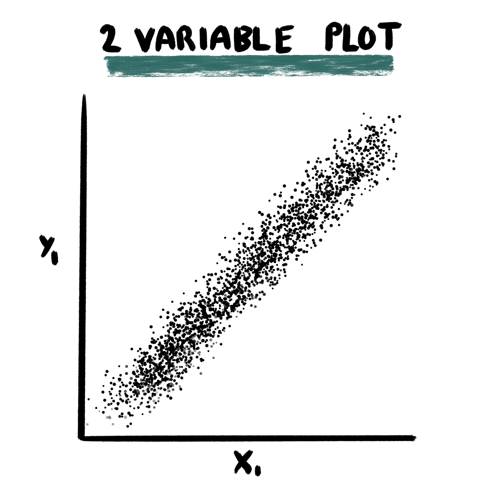
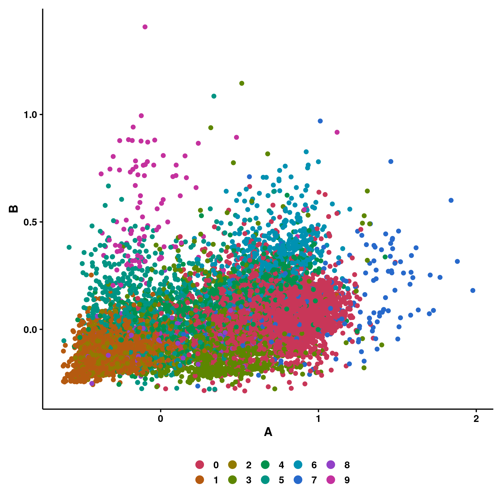
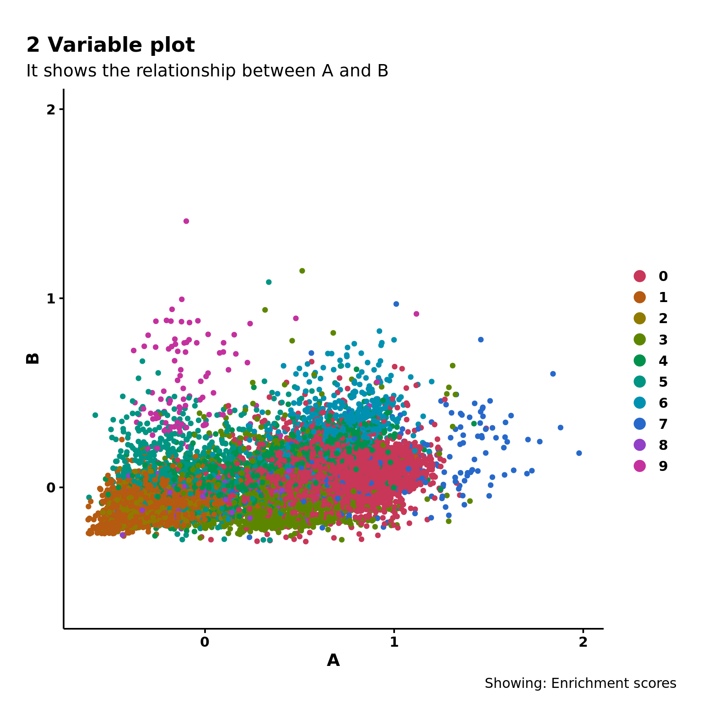
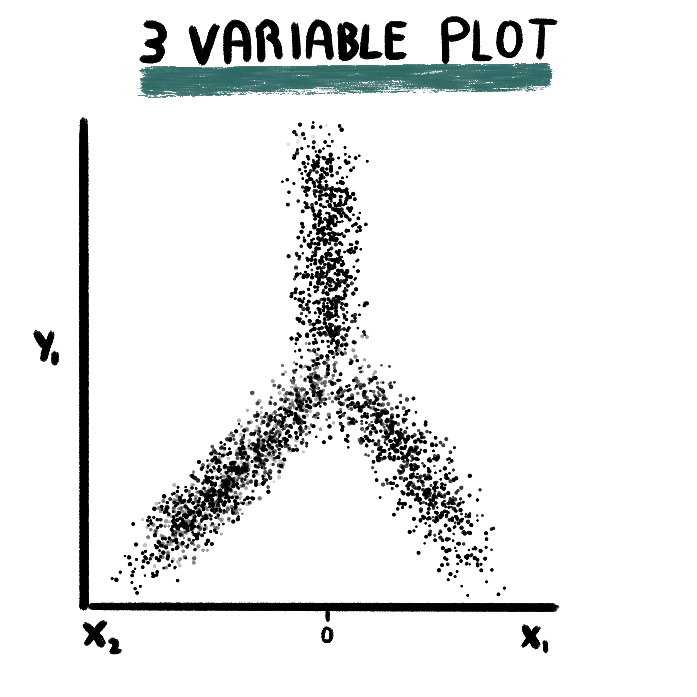
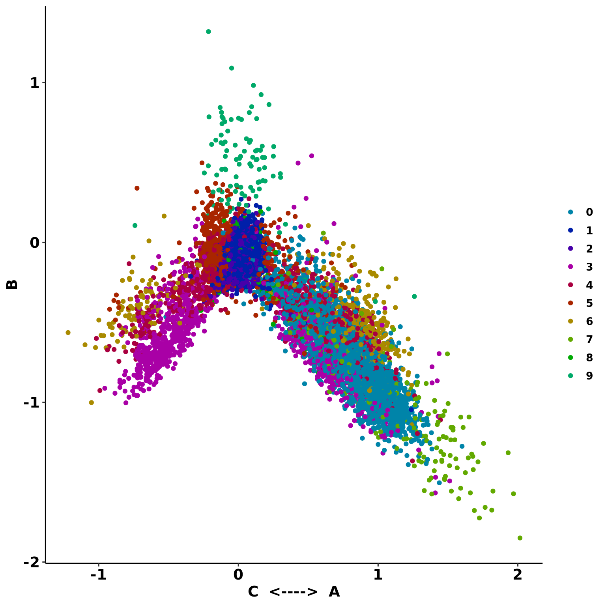
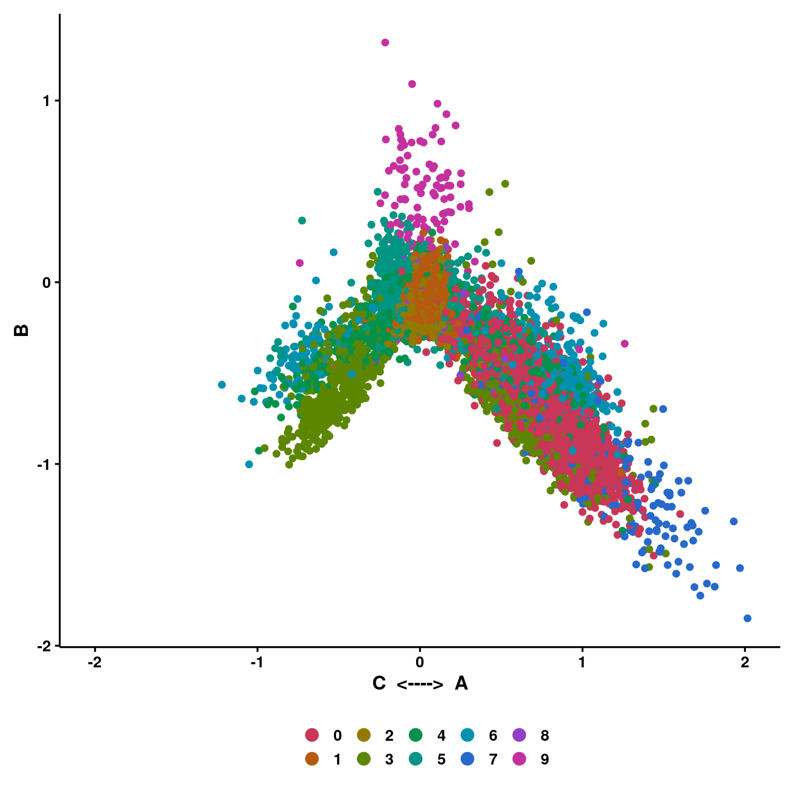
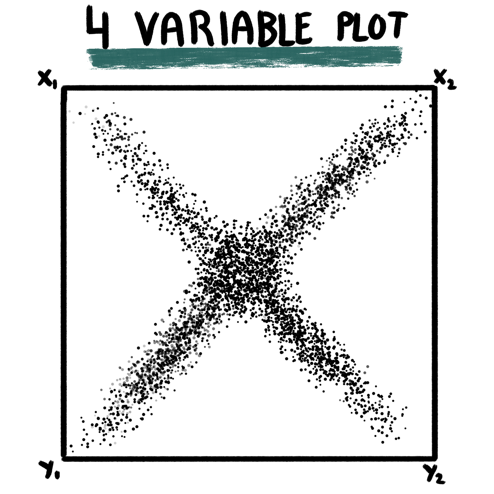
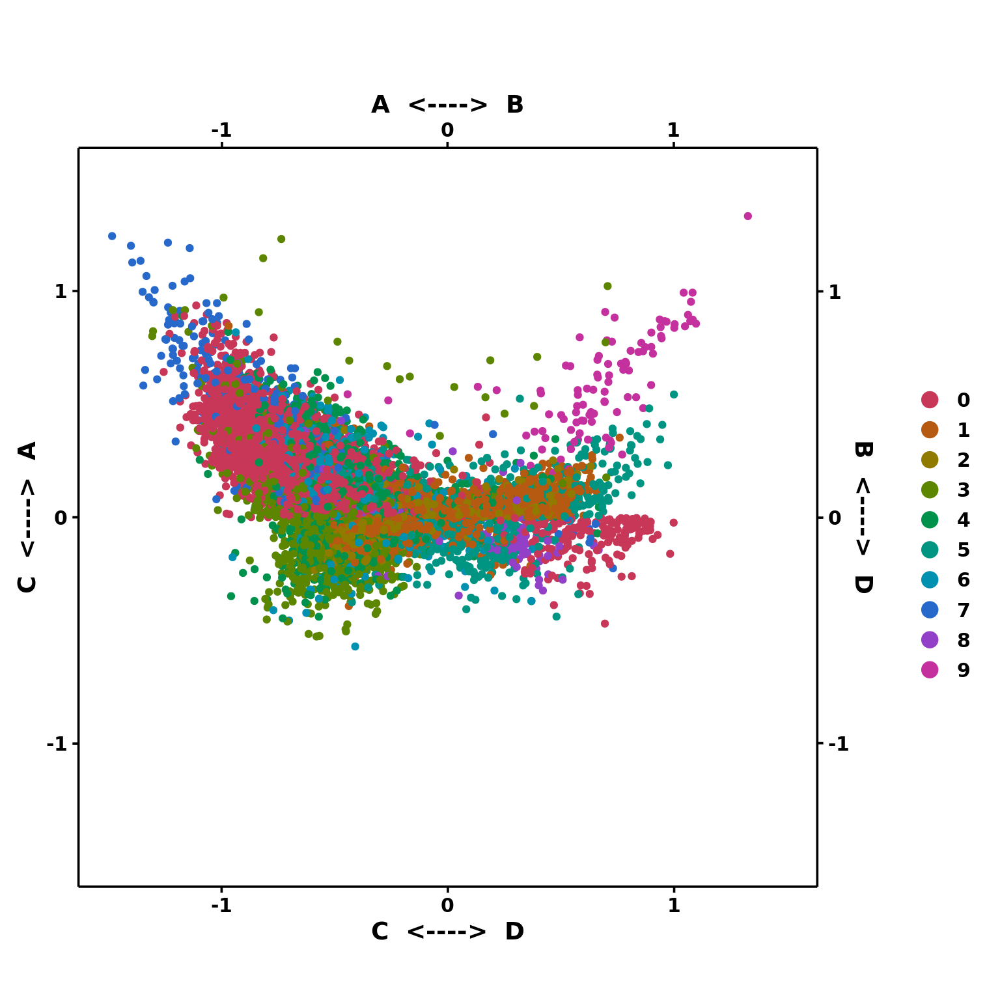

# Cellular State Plots


These plots are, on their bare basis, scatter plots. As of today, I am not completely sure if this is the correct name for the plot, but I will follow the name provided to such plot in [Neftel, et al, 2019](https://pubmed.ncbi.nlm.nih.gov/31327527/). The core concept of the function computing these plots, `SCpubr::do_CellularStatesPlot()` is that you only need a Seurat object and a *named list of gene signatures*. With this, the function will compute enrichment scores using `Seurat::AddModuleScore()` and store them as metadata in the object, that will be use for the plotting later on. That is why, alongside the list of gene signatures, the user needs to provide the names of the lists to be plotted as arguments.


```r
gene_set <- list("A" = Seurat::VariableFeatures(sample)[1:10],
                 "B" = Seurat::VariableFeatures(sample)[11:20],
                 "C" = Seurat::VariableFeatures(sample)[21:30],
                 "D" = Seurat::VariableFeatures(sample)[31:40])
```

## 2 variable plots

<span class="border-0"></span>

This is the easiest case. For this, the user needs to provide the name of *two gene signatures* present in the list of genes provided to `gene_list` parameter: 
- `x1`: The enrichment scores computed for this list will be displayed on the X axis.
- `y1`: The enrichment scores computed for this list will be displayed on the Y axis.


```r
p <- SCpubr::do_CellularStatesPlot(sample = sample,
                                   gene_list = gene_set,
                                   x1 = "A",
                                   y1 = "B")
p
```

<div class="figure" style="text-align: center">

<p class="caption">(\#fig:unnamed-chunk-3)SCpubr::do_CellularStatesPlot, 2 variables</p>
</div>

This way, we can see how much effect gene set A has with regards to gene set B. One can further enforce some simmetry in the plot with `enforce_symmetry = TRUE`. Also, title, subtitle and caption can be provided with `plot.title`, `plot.subtitle` and `plot.caption` parameter.


```r
p <- SCpubr::do_CellularStatesPlot(sample = sample,
                                   gene_list = gene_set,
                                   x1 = "A",
                                   y1 = "B",
                                   enforce_simmetry = TRUE,
                                   plot.title = "2 Variable plot",
                                   plot.subtitle = "It shows the relationship between A and B",
                                   plot.caption = "Showing: Enrichment scores")
p
```

<div class="figure" style="text-align: center">

<p class="caption">(\#fig:unnamed-chunk-4)SCpubr::do_CellularStatesPlot, 2 variables symmetry enforced</p>
</div>


## 3 variables
<span class="border-0"></span>

This plot is retrieved from [Tirosh, et al, 2016](https://www.nature.com/articles/nature20123) and plot requires the user to provide three gene sets, for which enrichment scores are computed using `Seurat::AddModuleScore`. For the X axis, two gene sets are assigned to it. Cells will be placed towards the right if they are enriched in `x1` and towards the left if they are enriched in `x2`. This is decided by, first, retrieving the enrichment scores for both lists and keeping the highest out of the two. The score will turn positive or negative depending on the gene list for which the highest enrichment score belonged to: positive for `x1` and negative for `x2`. For the Y axis. one gene set is provided. The value for the Y axis is computed by subtracting to the enrichment scores for `y1` the value for the X axis. 

This plot makes a lot of sense, as showcased by  [Tirosh, et al, 2016](https://www.nature.com/articles/nature20123), when the Y axis shows a differentiation trajectory. This is, it contains enrichment scores for *stemness* genes. Therefore, the lower on the Y axis, the less stem a given cell is. On the X axis, cells will order depending on whether they are enriched more in `x1` or `x2`. the more extreme the value on the X axis, the more differentiated towards the given list of genes the cell will be. 


```r
p <- SCpubr::do_CellularStatesPlot(sample = sample,
                                   gene_list = gene_set,
                                   x1 = "A",
                                   y1 = "B",
                                   x2 = "C")
p
```

<div class="figure" style="text-align: center">

<p class="caption">(\#fig:unnamed-chunk-5)SCpubr::do_CellularStatesPlot, 3 variables</p>
</div>

If `enforce_symmetry` is set to true, the X axis will have 0 as middle point.


```r
p <- SCpubr::do_CellularStatesPlot(sample = sample,
                                   gene_list = gene_set,
                                   x1 = "A",
                                   y1 = "B",
                                   x2 = "C",
                                   enforce_simmetry = TRUE,
                                   plot.title = "3 Variable plot",
                                   plot.subtitle = "It shows the relationship between B (Y axis) and A and C (X axis)",
                                   plot.caption = "Showing: Enrichment scores")
p
```

<div class="figure" style="text-align: center">

<p class="caption">(\#fig:unnamed-chunk-6)SCpubr::do_CellularStatesPlot, 3 variables symmetry enforced</p>
</div>
## 4 variables
<span class="border-0"></span>

This the most complicated variant of the plot, retrieved from [Neftel, et al, 2019](https://pubmed.ncbi.nlm.nih.gov/31327527/). This makes use of four gene sets: `x1`, `x2`, `y1` and `y2`. As a general, brief description, enrichment scores are computed for all 4 gene sets and the cells will locate in the resulting figure according to the list they are most enriched on, towards a given corner, following the scheme shown above.

This is achieved by assuming: 
- `x1` and `x2` are connected, so are `y1` and `y2`. The first step will be to decide which the highest score out of `x1`-`x2` and `y1`-`y2`, which will locate the cells either on the upper or lower half (Y axis).
- Then, for the X axis, and depending on whether the score for the Y axis is positive or negative, the values will be computed as the log2 logarithm of the absolute of the difference in enrichment scores plus 1: `log2(abs((x1 or y1) - (x2 or y2)) + 1)`. The resulting value will be positive or negative depending on whether the score for `x1` or `y1` is higher or lower than the score for `x2` or `y2`.


```r
p <- SCpubr::do_CellularStatesPlot(sample = sample,
                                   gene_list = gene_set,
                                   x1 = "A",
                                   y1 = "C",
                                   x2 = "B",
                                   y2 = "D")
p
```

<div class="figure" style="text-align: center">

<p class="caption">(\#fig:unnamed-chunk-7)SCpubr::do_CellularStatesPlot, 4 variables</p>
</div>

If `enforce_symmetry` is set to true, then the plot is completely squared. 


```r
p <- SCpubr::do_CellularStatesPlot(sample = sample,
                                   gene_list = gene_set,
                                   x1 = "A",
                                   y1 = "C",
                                   x2 = "B",
                                   y2 = "D",
                                   enforce_simmetry = TRUE)
p
```

<div class="figure" style="text-align: center">

<p class="caption">(\#fig:unnamed-chunk-8)SCpubr::do_CellularStatesPlot, 4 variables symmetry enforced</p>
</div>
