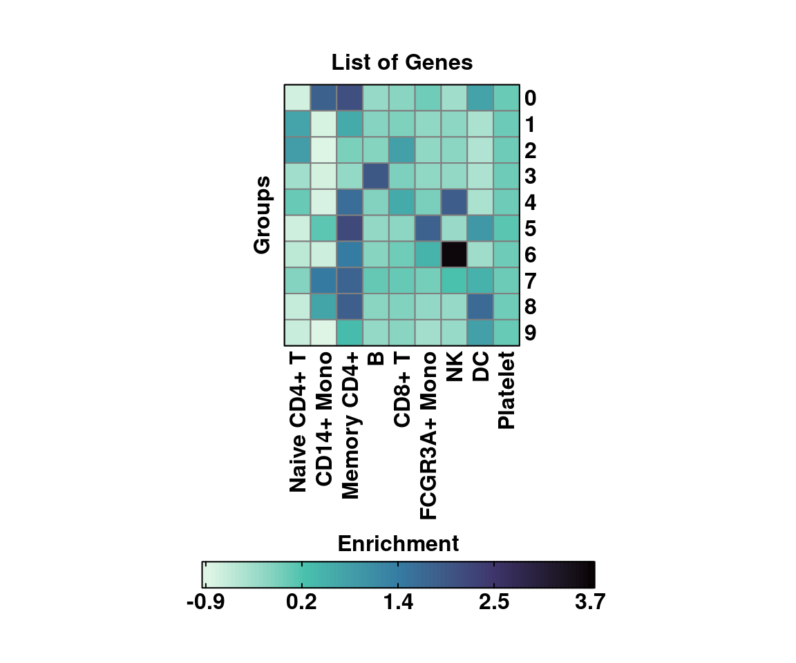
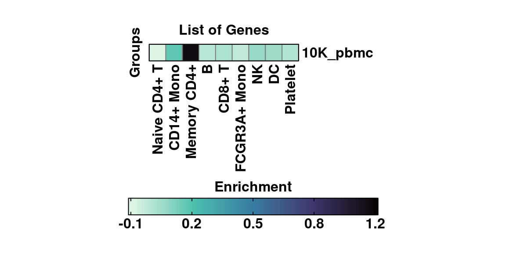
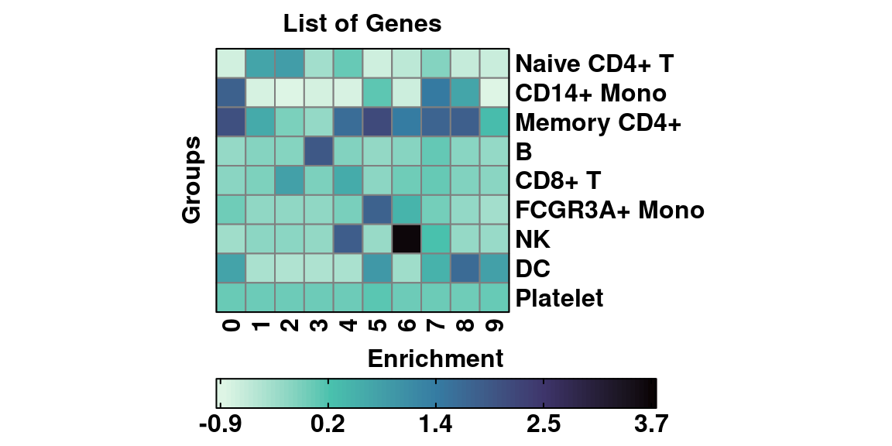
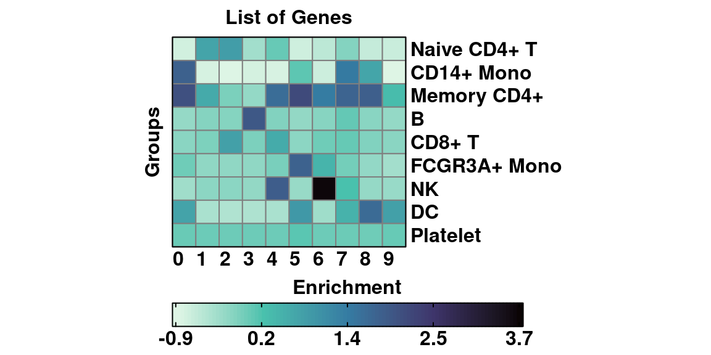
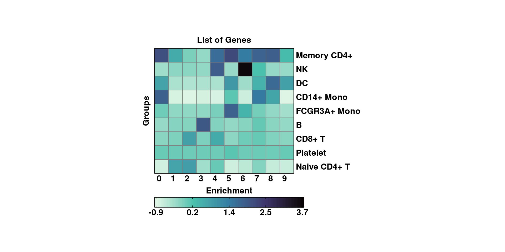
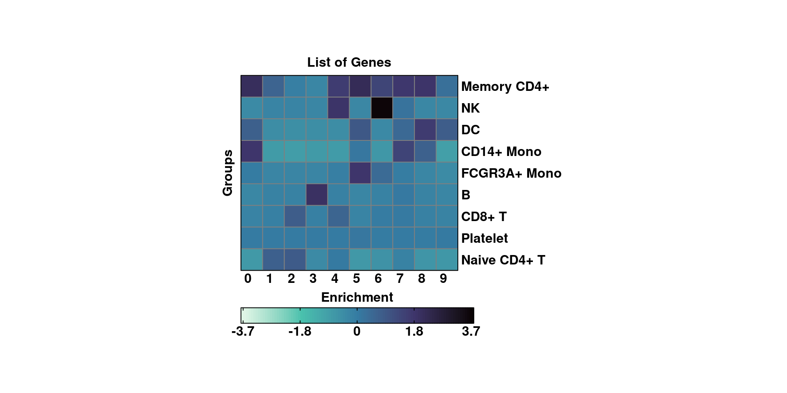
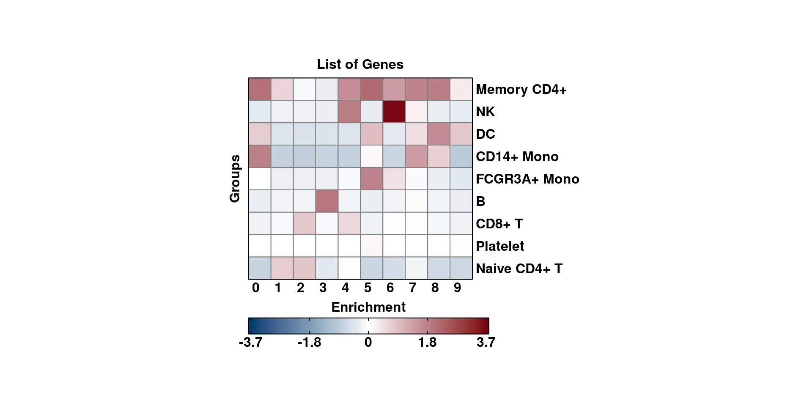

# Enrichment score heatmaps

A very common approach to make sense of your cells is to query several list of marker genes, retrieved from literature, and compute how enriched each cell is in each given list of genes. This is achieved by using `Seurat::AddModuleScore`. The scores can be then visualized as a Feature plot, but one can also aggregate the enrichment scores by any variable of interest, for instance the different clusters in the sample.


This kind of heatmaps can be easily computed using `SCpubr::do_EnrichmentHeatmap()`:

## Single grouping variable


```r
# Define list of genes.
genes <- list("Naive CD4+ T" = c("IL7R", "CCR7"),
              "CD14+ Mono" = c("CD14", "LYZ"),
              "Memory CD4+" = c("S100A4"),
              "B" = c("MS4A1"),
              "CD8+ T" = c("CD8A"),
              "FCGR3A+ Mono" = c("FCGR3A", "MS4A7"),
              "NK" = c("GNLY", "NKG7"),
              "DC" = c("FCER1A", "CST3"),
              "Platelet" = c("PPBP"))

# Default parameters.
p <- SCpubr::do_EnrichmentHeatmap(sample = sample,
                                  input_gene_list = genes)
p
```

<div class="figure" style="text-align: center">

<p class="caption">(\#fig:unnamed-chunk-2)SCpubr::do_EnrichmentHeatmap with default parameters.</p>
</div>
By default, `SCpubr::do_EnrichmentHeatmap` aggregates the values by the current identity. However, other metadata variables can be used to aggregate for. For this, provide the name to `group.by` parameter.


```r
# Custom aggregated values.
p <- SCpubr::do_EnrichmentHeatmap(sample = sample,
                                  input_gene_list = genes,
                                  group.by = "orig.ident")
p
```

<div class="figure" style="text-align: center">

<p class="caption">(\#fig:unnamed-chunk-3)SCpubr::do_EnrichmentHeatmap with custom aggregation.</p>
</div>

The matrix can be transposed using `transpose = TRUE`.


```r
# Transposing the matrix.
p <- SCpubr::do_EnrichmentHeatmap(sample = sample,
                                  input_gene_list = genes,
                                  transpose = TRUE)
p
```

<div class="figure" style="text-align: center">

<p class="caption">(\#fig:unnamed-chunk-4)SCpubr::do_EnrichmentHeatmap transposed matrix.</p>
</div>


Both rows and column names can be rotated using `column_names_rot`  and `row_names_rot` parameters, providing the desired angle.


```r
# Rotating the labels.
p <- SCpubr::do_EnrichmentHeatmap(sample = sample,
                                  input_gene_list = genes,
                                  transpose = TRUE,
                                  column_names_rot = 0)
p
```

<div class="figure" style="text-align: center">

<p class="caption">(\#fig:unnamed-chunk-5)SCpubr::do_EnrichmentHeatmap transposed matrix different angle for column names.</p>
</div>

## Changing the cell size in the heatmap.

By design, the aspect ratio of the tiles in the heatmap is fixed so that cells are squares, and not rectangles. However, the user has the possibility to increase/decrease the cell size of each tile by modifying `cell_size` parameter. This is set to 5 by default.

```r
# Modifying the tile size.
p <- SCpubr::do_EnrichmentHeatmap(sample = sample,
                                  input_gene_list = genes,
                                  transpose = TRUE,
                                  column_names_rot = 0,
                                  cluster_cols = FALSE,
                                  cluster_rows = TRUE,
                                  cell_size = 7)
p
```

<div class="figure" style="text-align: center">

<p class="caption">(\#fig:unnamed-chunk-6)SCpubr::do_EnrichmentHeatmap transposed matrix using split.by changing the tile size.</p>
</div>

## Symmetrical scales.

If one wants a symmetrical scale, 


```r
# Symmetrical scale viriis.
p <- SCpubr::do_EnrichmentHeatmap(sample = sample,
                                  input_gene_list = genes,
                                  transpose = TRUE,
                                  column_names_rot = 0,
                                  cluster_cols = FALSE,
                                  cluster_rows = TRUE,
                                  cell_size = 7,
                                  symmetrical_scale = TRUE)
p
```

<div class="figure" style="text-align: center">

<p class="caption">(\#fig:unnamed-chunk-7)SCpubr::do_EnrichmentHeatmap with symmetrical scale.</p>
</div>


```r
# Modifying the symmetrical scale non viridis.
p <- SCpubr::do_EnrichmentHeatmap(sample = sample,
                                  input_gene_list = genes,
                                  transpose = TRUE,
                                  column_names_rot = 0,
                                  cluster_cols = FALSE,
                                  cluster_rows = TRUE,
                                  cell_size = 7,
                                  symmetrical_scale = TRUE,
                                  use_viridis = FALSE)
p
```

<div class="figure" style="text-align: center">

<p class="caption">(\#fig:unnamed-chunk-8)SCpubr::do_EnrichmentHeatmap with symmetrical scale.</p>
</div>
