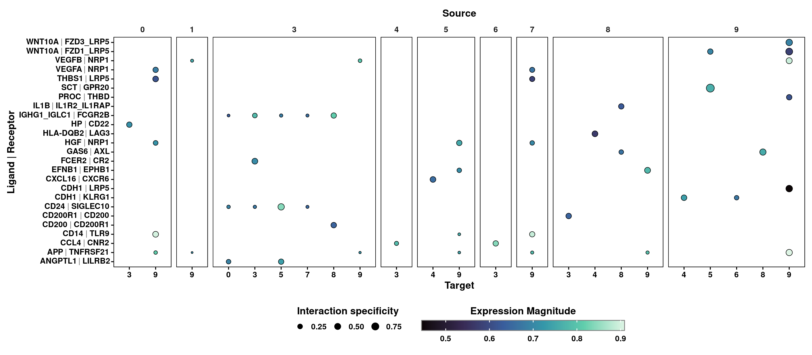
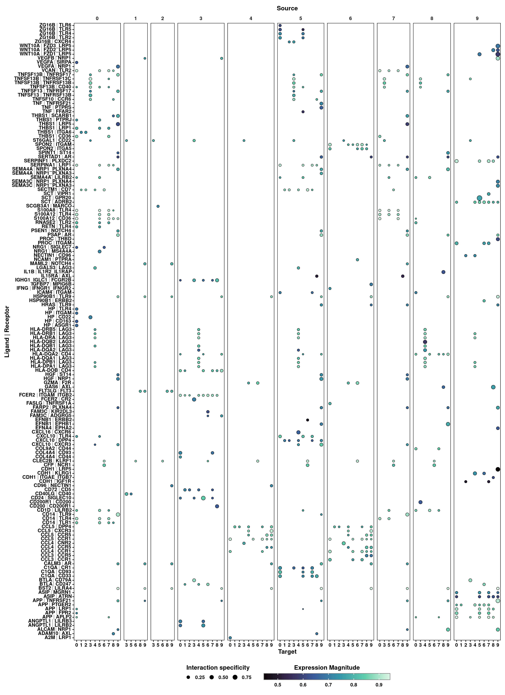
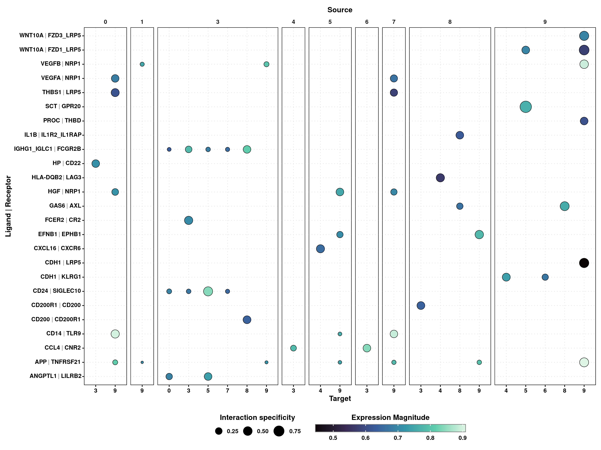
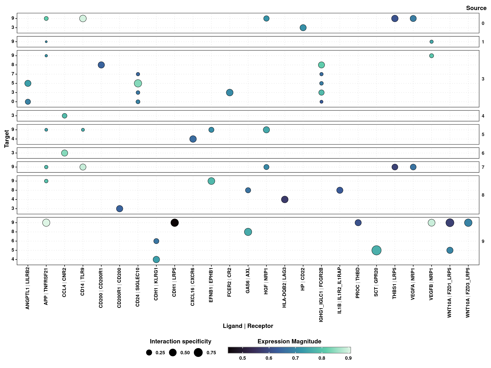
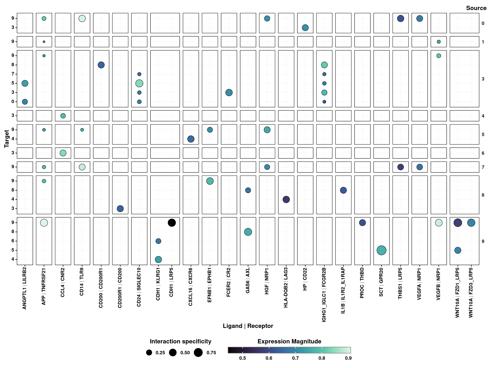

# Ligand-Receptor analysis


One very interesting analysis that can be carried out is **Ligand-Receptor analysis**. This allows to compute whether specific clusters interact with each other based on the co-expression of a ligand and its receptor in the respective clusters. The interactions are retrieved from different databases and a plethora of tools have been released to tackle this analysis. One of them is [liana](https://saezlab.github.io/liana/index.html), which is a framework that allows to run and **integrate** the results of several tools, providing a meta-analysis of the co-expression of ligand-receptor pairs. `SCpubr` makes use of `liana` and has its analysis and visualization integrated in the `SCpubr::do_LigandReceptorPlot()` function. 

By default, the user has to run `liana` on their own and provide the resulting output as input for the function. The following code would produces the object that `SCpubr::do_LigandReceptorPlot()` expects as input:


```r
liana_output <- liana::liana_wrap(sce = sample,
                                  method = c("natmi", "connectome", "logfc", "sca", "cellphonedb"),
                                  idents_col = NULL,
                                  verbose = FALSE,
                                  assay = "SCT")
```

It is very important to note that `liana_output` has to contain the five different methods. This is a design choice. One can get the full output from scratch also running:


```r
p <- SCPubr::do_LigandReceptorPlot(sample = sample)
```

The same output can be retrieved from:


```r
# Ligand Receptor analysis plot.
p <- SCpubr::do_LigandReceptorPlot(liana_output = liana_output)
p
```

<div class="figure" style="text-align: center">

<p class="caption">(\#fig:unnamed-chunk-4)SCpubr do_LigandReceptorPlot default output.</p>
</div>

By default, top 25 unique, most significant interactions are retrieved and plotted. However, this can be changed by using `top_interactions`. Also, clusters that have no interactions, both as source and target, will be removed.:


```r
# Ligand Receptor analysis plot with extra interactions.
p <- SCpubr::do_LigandReceptorPlot(liana_output = liana_output,
                                   top_interactions = 150)
p
```

<div class="figure" style="text-align: center">

<p class="caption">(\#fig:unnamed-chunk-5)SCpubr do_LigandReceptorPlot default output with extra interactions.</p>
</div>

Size of dots can be modified with `dot.size`:


```r
# Ligand Receptor analysis plot with increased dot size.
p <- SCpubr::do_LigandReceptorPlot(liana_output = liana_output,
                                   dot.size = 2)
p
```

<div class="figure" style="text-align: center">

<p class="caption">(\#fig:unnamed-chunk-6)SCpubr do_LigandReceptorPlot with increased dot size.</p>
</div>
One can also draw some grid lines. This is specially useful when the plot gets too big. This can be achieved by using `plot_grid = TRUE`. The grid lines can be controlled using `grid.type` and the color with `grid.color`: 


```r
# Ligand Receptor analysis plot with grid.
p <- SCpubr::do_LigandReceptorPlot(liana_output = liana_output,
                                   dot.size = 2,
                                   plot_grid = TRUE,
                                   grid.color = "grey90",
                                   grid.type = "dotted")
p
```

<div class="figure" style="text-align: center">

<p class="caption">(\#fig:unnamed-chunk-7)SCpubr do_LigandReceptorPlot with grid lines.</p>
</div>

For the cases in which one want to plot a lot of interactions, the plot can be flipped with `flip = TRUE`. X axis labels can be rotated with `x_labels_angle`, providing either 0, 45 or 90 degrees and strip text can be also rotated with `rotate_strip_text = TRUE`.


```r
# Ligand Receptor analysis plot with inverted axes.
p <- SCpubr::do_LigandReceptorPlot(liana_output = liana_output,
                                   dot.size = 2,
                                   plot_grid = TRUE,
                                   grid.color = "grey90",
                                   grid.type = "dotted",
                                   flip = TRUE, 
                                   x_labels_angle = 90,
                                   rotate_strip_text = TRUE)
p
```

<div class="figure" style="text-align: center">

<p class="caption">(\#fig:unnamed-chunk-8)SCpubr do_LigandReceptorPlot with inverted axes.</p>
</div>

Furthermore, the plot can be also further divided by grouping the interactions by common ligand or receptor complex. This can be achieved using `split.by` parameter.:

```r
# Ligand Receptor analysis plot with inverted axes grouped by ligand.complex.
p <- SCpubr::do_LigandReceptorPlot(liana_output = liana_output,
                                   dot.size = 2,
                                   plot_grid = TRUE,
                                   grid.color = "grey90",
                                   grid.type = "dotted",
                                   flip = TRUE, 
                                   x_labels_angle = 90,
                                   rotate_strip_text = TRUE,
                                   split.by = "ligand.complex")
p
```

<div class="figure" style="text-align: center">

<p class="caption">(\#fig:unnamed-chunk-9)SCpubr do_LigandReceptorPlot split by ligand.complex.</p>
</div>


```r
# Ligand Receptor analysis plot with inverted axes grouped by ligand.complex.
p <- SCpubr::do_LigandReceptorPlot(liana_output = liana_output,
                                   dot.size = 2,
                                   plot_grid = TRUE,
                                   grid.color = "grey90",
                                   grid.type = "dotted",
                                   flip = TRUE, 
                                   x_labels_angle = 90,
                                   rotate_strip_text = TRUE,
                                   split.by = "receptor.complex")
p
```

<div class="figure" style="text-align: center">

<p class="caption">(\#fig:unnamed-chunk-10)SCpubr do_LigandReceptorPlot split by receptor.complex.</p>
</div>

Finally, one can also restrict the output to given source and target clusters. This can be achieved by provided the desired identities to `keep_source` and `keep_target`:


```r
# Ligand Receptor analysis plot with inverted axes with filtered source and targets.
p <- SCpubr::do_LigandReceptorPlot(liana_output = liana_output,
                                   top_interactions = 150,
                                   dot.size = 2,
                                   plot_grid = TRUE,
                                   grid.color = "grey90",
                                   grid.type = "dotted",
                                   flip = TRUE, 
                                   x_labels_angle = 90,
                                   rotate_strip_text = TRUE,
                                   keep_source = c("0", "1", "8"),
                                   keep_target = c("3", "5", "7"))
p
```

<div class="figure" style="text-align: center">

<p class="caption">(\#fig:unnamed-chunk-11)SCpubr do_LigandReceptorPlot with filtered source and targets.</p>
</div>
