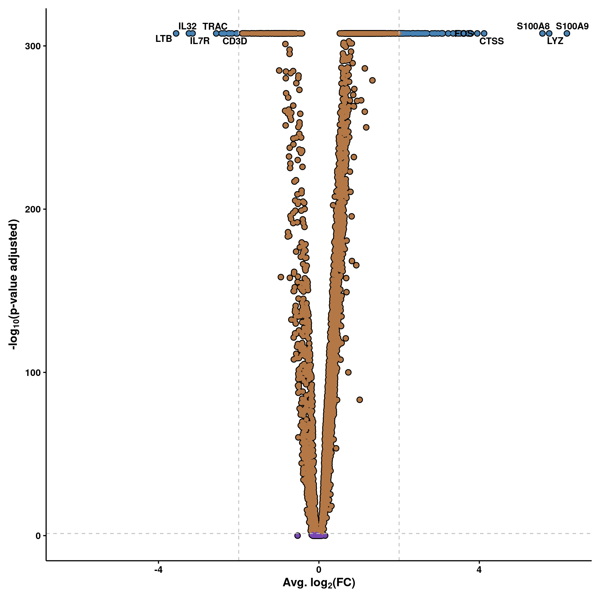
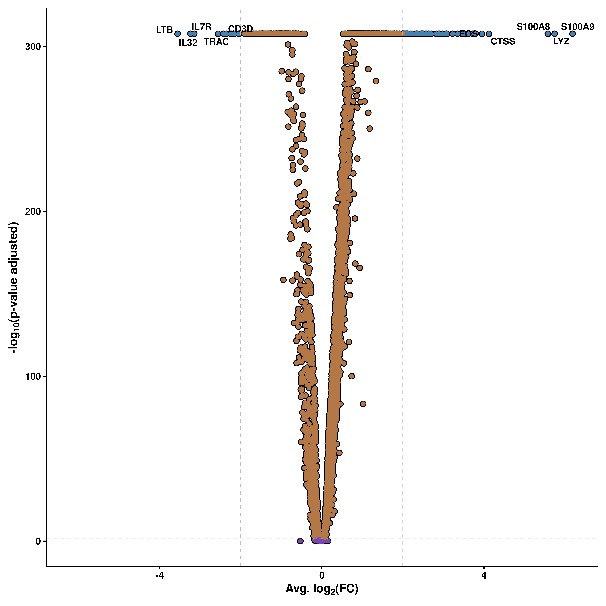
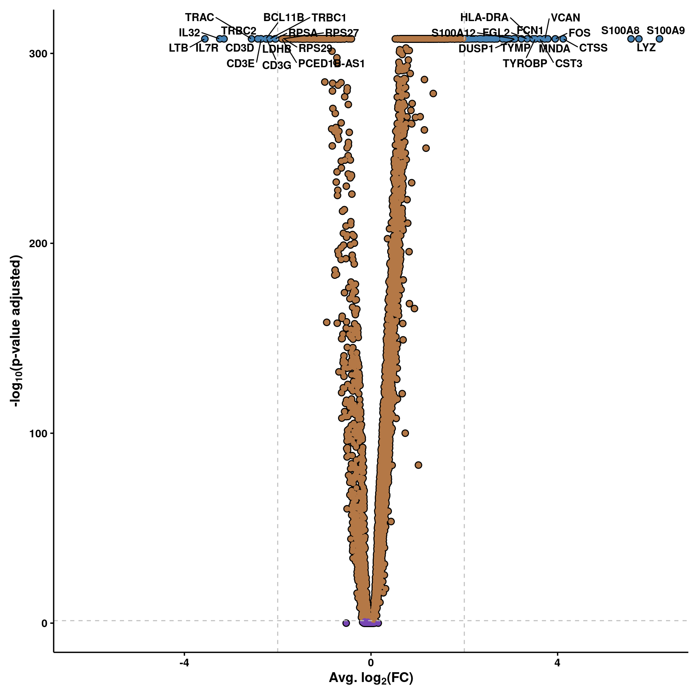

# Volcano plots

Perhaps one of the most known type of plots for bulk transcriptomics. By computing DE genes across two conditions, the results can be plotted as a volcano plot. This plot features the genes as dots, and places them in a scatter plot where the X axis contains the degree in which a gene is differentially expressed (average log2(FC)), while the Y axis shows the how significant the gene is (-log10(p-value adjusted)). 

## Basic usage
To generate such a plot, one can use `SCpubr::do_VolcanoPlot()`, which needs as input the Seurat object and the result of running `Seurat::FindMarkers()` choosing two groups.


```r
# Generate a volcano plot.
p <- SCpubr::do_VolcanoPlot(sample = sample,
                            de_genes = de_genes)
p
```

<div class="figure" style="text-align: center">

<p class="caption">(\#fig:unnamed-chunk-2)SCpubr::do_VolcanoPlot with default parameters.</p>
</div>

As you can see, there are four major groups of genes:
- Genes that surpass our p-value and logFC cutoffs (blue).
- Genes that surpass the p-value cutoff but not the logFC cutoff (orange).
- Genes that surpass the logFC cutoff but not the p-value cutoff (purple, not shown).
- Genes that do not surpass any cutoff (green).

## Modify the cutoffss

The cutofss can be set up by the user using `pval_cutoff` (without -log10 transforming) and `FC_cutoff` (avg log2(FC)).


```r
# Modify cutoffs.
p <- SCpubr::do_VolcanoPlot(sample = sample,
                            de_genes = de_genes,
                            pval_cutoff = 1e-15,
                            FC_cutoff = 0.2)
p
```

<div class="figure" style="text-align: center">

<p class="caption">(\#fig:unnamed-chunk-3)SCpubr::do_VolcanoPlot modifying cutoffs.</p>
</div>

## Modify the gene tags
By default, the top 5 genes on each side, ordered by `-log10(p-value adjusted)` and `average log2(FC)` are reported. However, one can increase the number by using


```r
# Modify number of gene tags.
p <- SCpubr::do_VolcanoPlot(sample = sample,
                            de_genes = de_genes,
                            n_genes = 15)
p
```

<div class="figure" style="text-align: center">

<p class="caption">(\#fig:unnamed-chunk-4)SCpubr::do_VolcanoPlot modifying the number of gene tags.</p>
</div>


