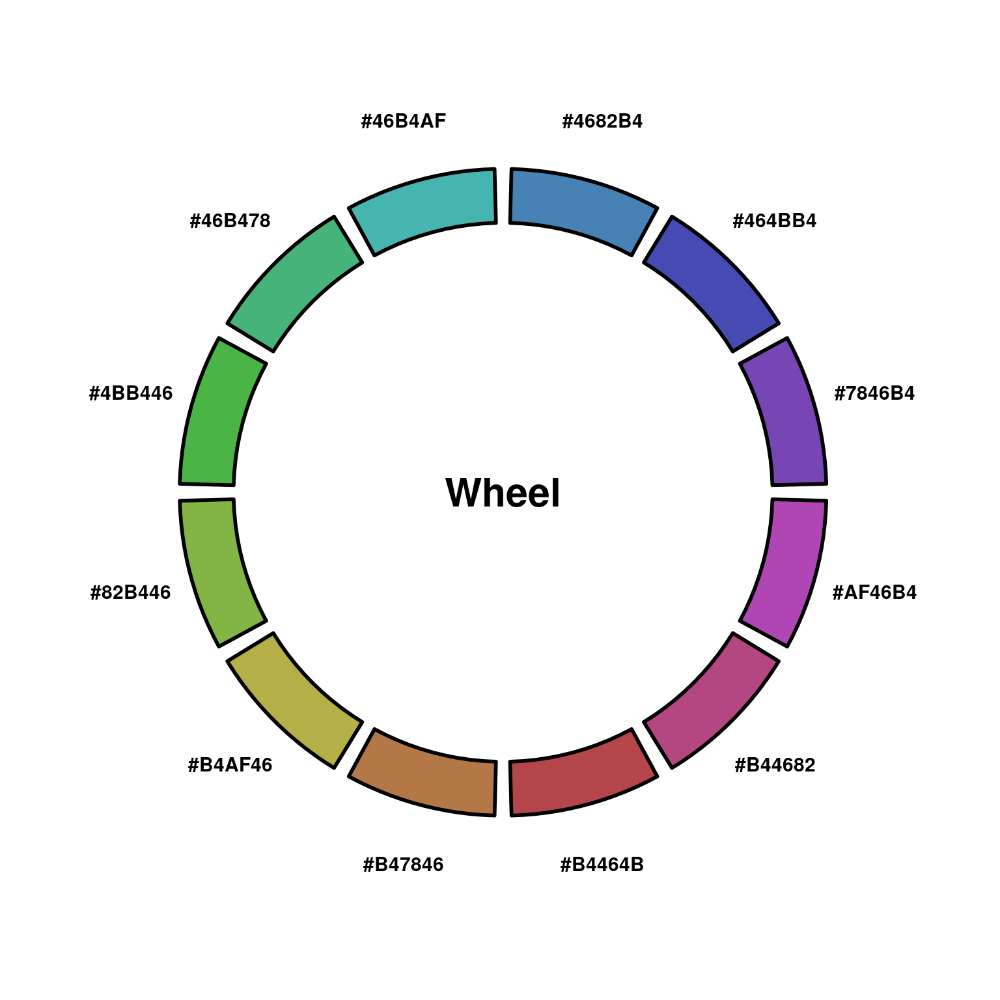
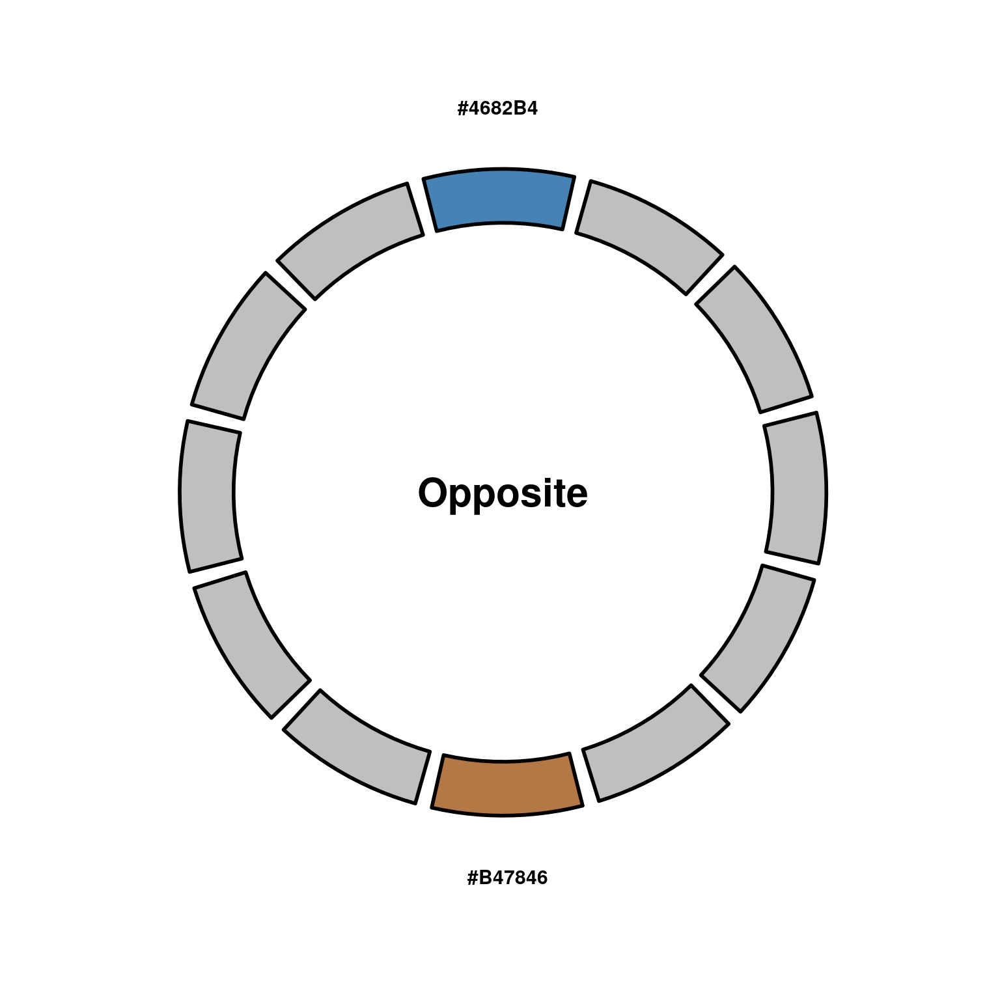
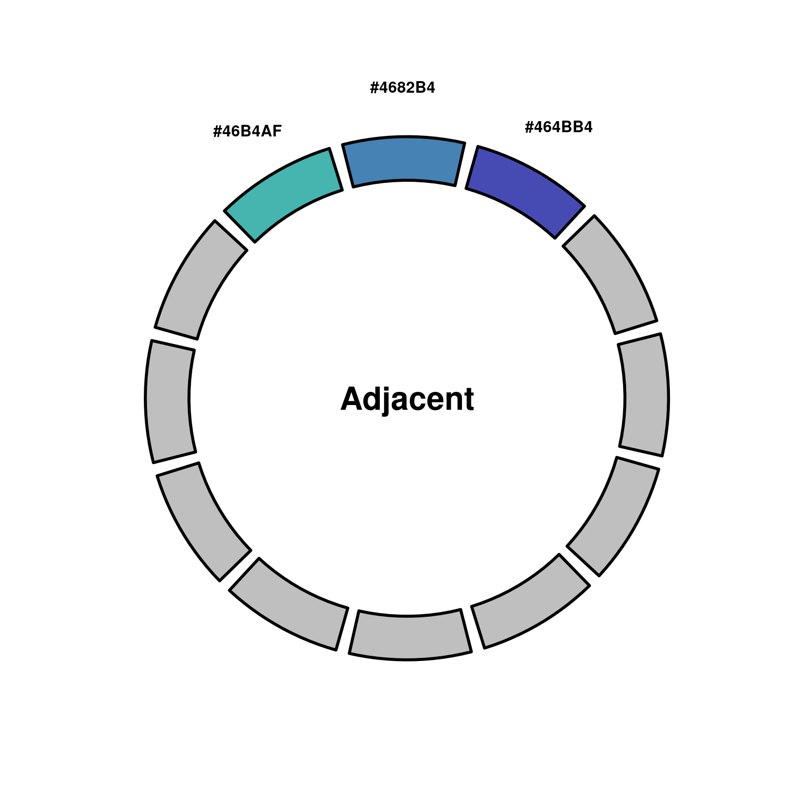
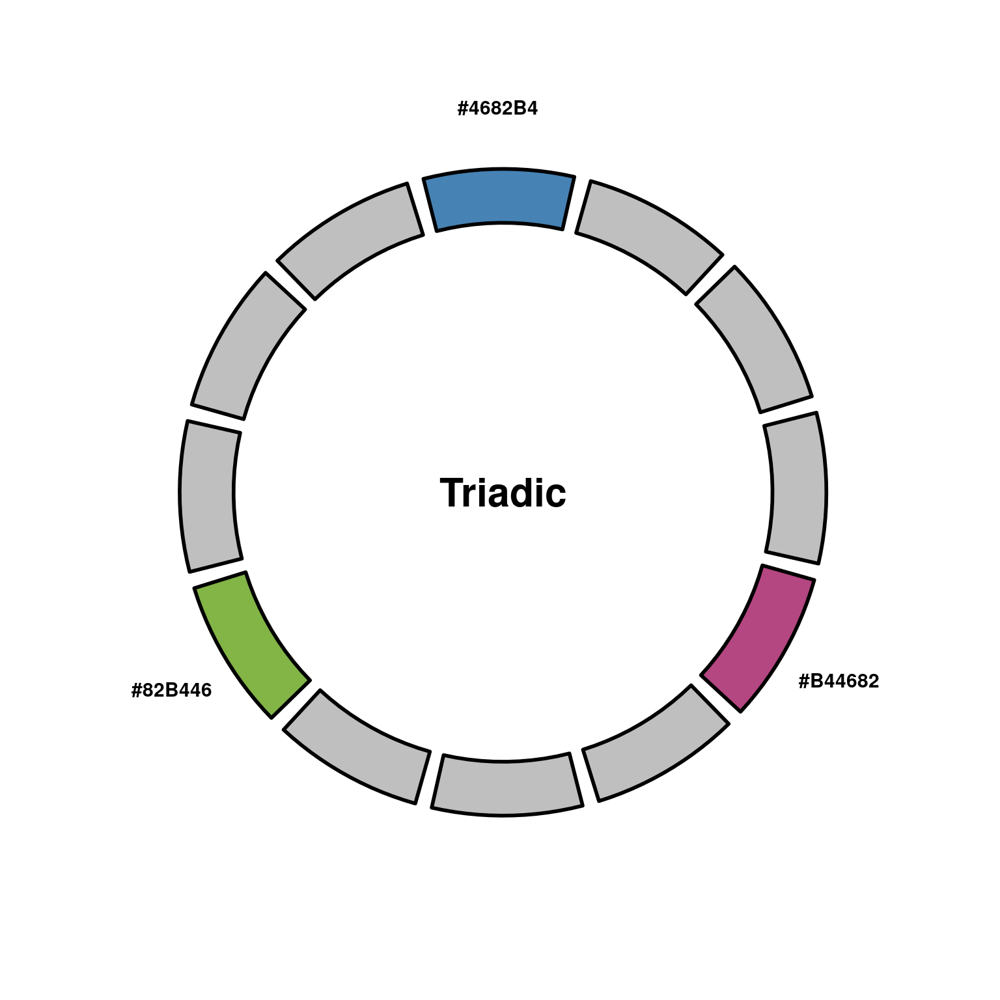
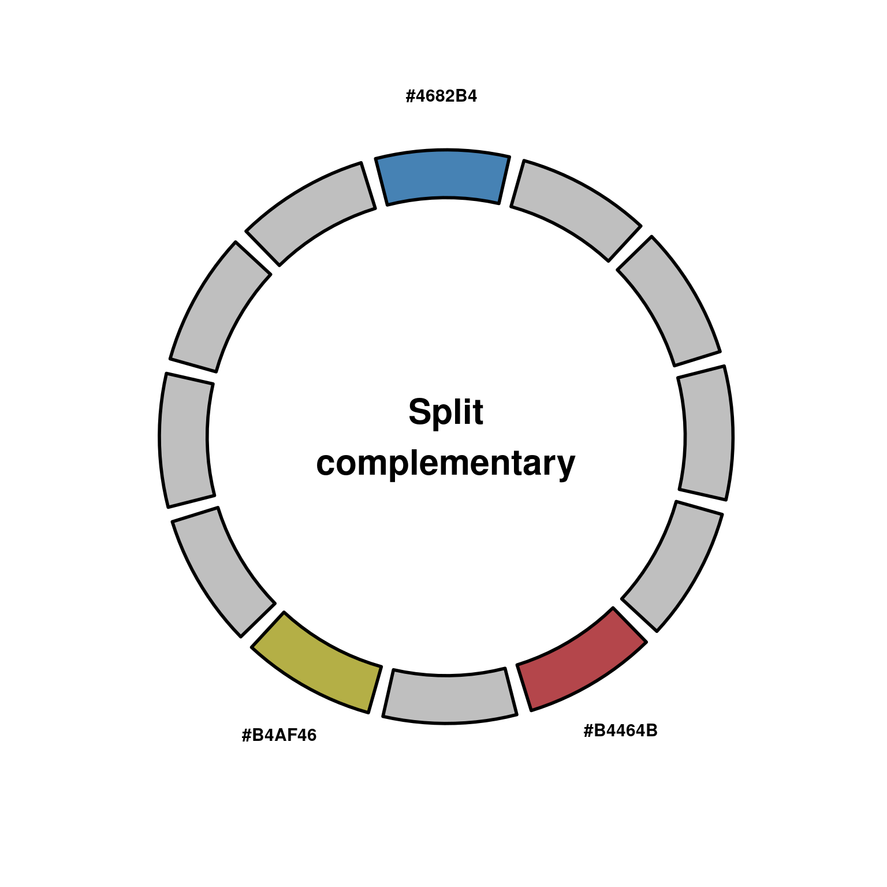
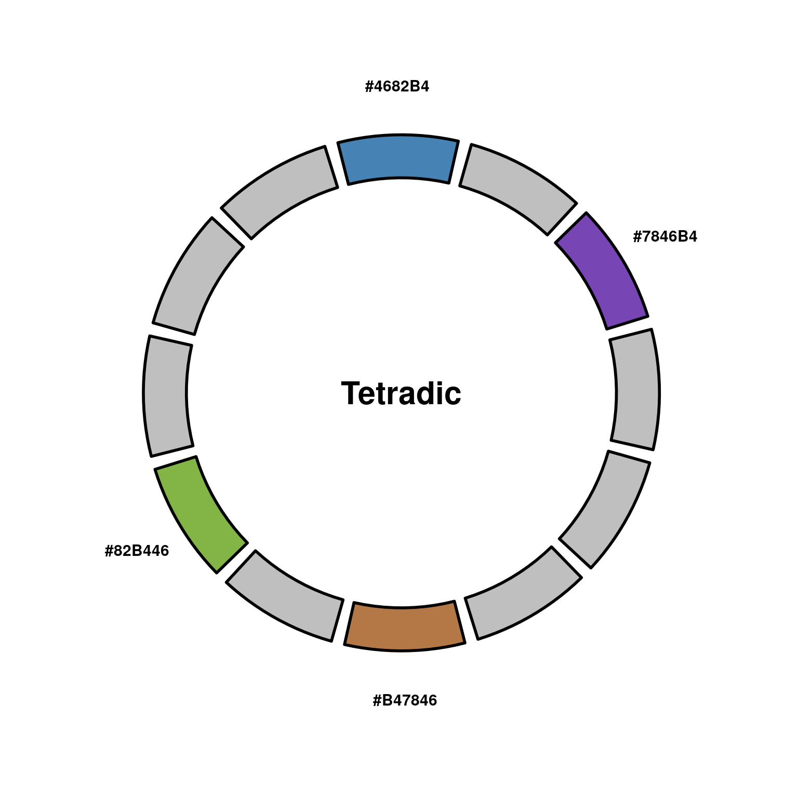
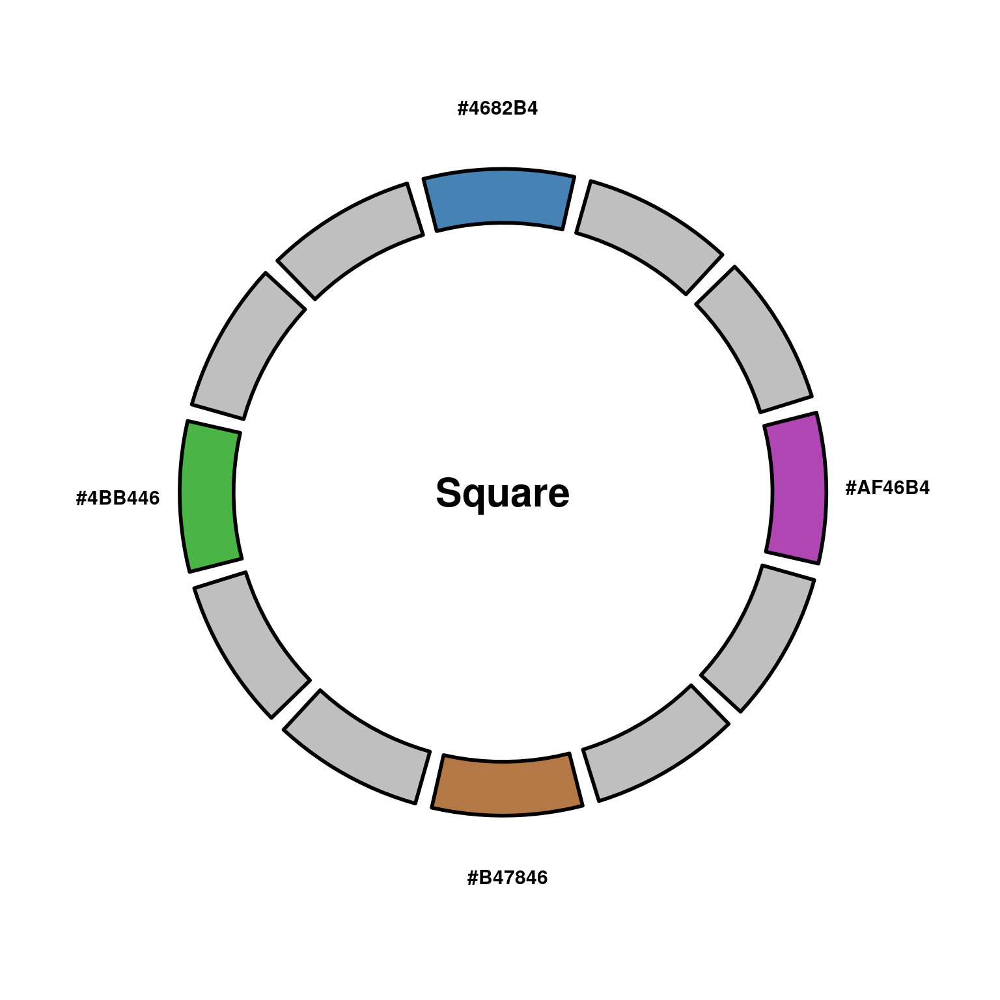
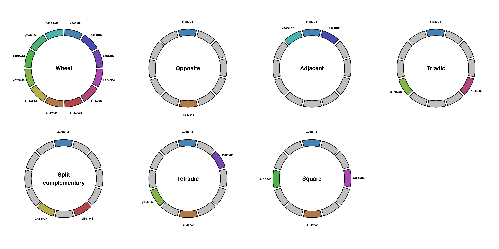

# Color palettes

Almost as important as the plot itself is the correct choice of colors. For **continuous variables**, [viridis package](https://cran.r-project.org/web/packages/viridis/vignettes/intro-to-viridis.html) does wonders. However, when it comes to **categorical variables**, that have a define set of values, choosing the correct colors can be a very difficult task, normally leading to sub-optimal choices.

Targeting this problem, [colortools package](https://rpubs.com/gaston/colortools) was designed by [Gaston Sanchez](https://www.gastonsanchez.com/). However, as of 23-06-2022, the package [was removed from CRAN](https://cran.r-project.org/web/packages/colortools/index.html), without clear signs of it being restored (as of the date of writing of this section, 13-07-2022). To cover its functionally, `SCpubr` has a function called `SCpubr::do_ColorPalette()`, which recapitulates the most critical functionalities from the package. The core of the code and functionality **belongs to Gaston Sanchez**, and the **source code** can be found [in colortools' GitHub](https://github.com/microsoft/terminal/tree/main/src/tools/ColorTool). The **plotting  and complete report functionalities** are `SCpubr`'s additions to the code.

## Generate color palettes

The simplest way to generate a color palette with `SCpubr::do_ColorPalette()` is to provide **a single color** to `colors.use` parameter. It is important to remark that only **one color** has to be provided. The function iterates over the whole range of **HUE values** and generate equally spaced colors.


```r
# Generate a color palette.
SCpubr::do_ColorPalette(colors.use = "steelblue")
#>  [1] "#4682B4" "#464BB4" "#7846B4" "#AF46B4" "#B44682"
#>  [6] "#B4464B" "#B47846" "#B4AF46" "#82B446" "#4BB446"
#> [11] "#46B478" "#46B4AF"
```

By default, it returns **12 colors**, but this can be changed by using `n` parameter.


```r
# Generate a color palette with a given number of colors.
SCpubr::do_ColorPalette(colors.use = "steelblue",
                        n = 7)
#> [1] "#4682B4" "#6846B4" "#B446A1" "#B44946" "#B4A746"
#> [6] "#63B446" "#46B488"
```

Just having the colors as a vector is great to use them right away in other plotting functions. However, one can visualize how the colors look like by using `plot = TRUE`.


```r
# Generate a color palette and plot it.
p <- SCpubr::do_ColorPalette(colors.use = "steelblue",
                             plot = TRUE)

p
```

<div class="figure" style="text-align: center">

<p class="caption">(\#fig:unnamed-chunk-3)SCpubr::do_ColorPalette basic plot.</p>
</div>

## Generate combination of colors

Other times, one might just want a given combination of colors, following the **color theory**. For this different parameters can be used. Using them will force `n` to be 12, so do not use `n` parameter alongside them, as it will have no effect.

### Opposite colors.


```r
# Generate opposite colors.
p <- SCpubr::do_ColorPalette(colors.use = "steelblue",
                             opposite = TRUE,
                             plot = TRUE)

p
```

<div class="figure" style="text-align: center">

<p class="caption">(\#fig:unnamed-chunk-4)SCpubr::do_ColorPalette opposite colors.</p>
</div>

### Adjacent colors.


```r
# Generate adjacent colors.
p <- SCpubr::do_ColorPalette(colors.use = "steelblue",
                             adjacent = TRUE,
                             plot = TRUE)

p
```

<div class="figure" style="text-align: center">

<p class="caption">(\#fig:unnamed-chunk-5)SCpubr::do_ColorPalette adjacent colors.</p>
</div>

### Triadic colors.


```r
# Generate triadic colors.
p <- SCpubr::do_ColorPalette(colors.use = "steelblue",
                             triadic = TRUE,
                             plot = TRUE)

p
```

<div class="figure" style="text-align: center">

<p class="caption">(\#fig:unnamed-chunk-6)SCpubr::do_ColorPalette triadic colors.</p>
</div>

### Split complementary colors.


```r
# Generate split complementary colors.
p <- SCpubr::do_ColorPalette(colors.use = "steelblue",
                             split_complementary = TRUE,
                             plot = TRUE)

p
```

<div class="figure" style="text-align: center">

<p class="caption">(\#fig:unnamed-chunk-7)SCpubr::do_ColorPalette split complementary colors.</p>
</div>

### Tetradic colors.


```r
# Generate tetradic colors
p <- SCpubr::do_ColorPalette(colors.use = "steelblue",
                             tetradic = TRUE,
                             plot = TRUE)

p
```

<div class="figure" style="text-align: center">

<p class="caption">(\#fig:unnamed-chunk-8)SCpubr::do_ColorPalette tetradic colors.</p>
</div>


### Square colors.


```r
# Generate square colors
p <- SCpubr::do_ColorPalette(colors.use = "steelblue",
                             square = TRUE,
                             plot = TRUE)

p
```

<div class="figure" style="text-align: center">

<p class="caption">(\#fig:unnamed-chunk-9)SCpubr::do_ColorPalette square colors.</p>
</div>

## Generate a color report

However, it might be the case that one wants all combinations at the same time, to then select the one that works best. To achieve this, set `complete_output = TRUE`.


```r
# Generate a color report.
out <- SCpubr::do_ColorPalette(colors.use = "steelblue",
                               complete_output = TRUE)

# Retrieve the color vectors.
color_vectors <- out$colors

# Retrieve the individual plots.
plots <- out$plots

# Retrieve a joint plot.
p <- out$combined_plot
p
```

<div class="figure" style="text-align: center">

<p class="caption">(\#fig:unnamed-chunk-10)SCpubr::do_ColorPalette square colors.</p>
</div>
