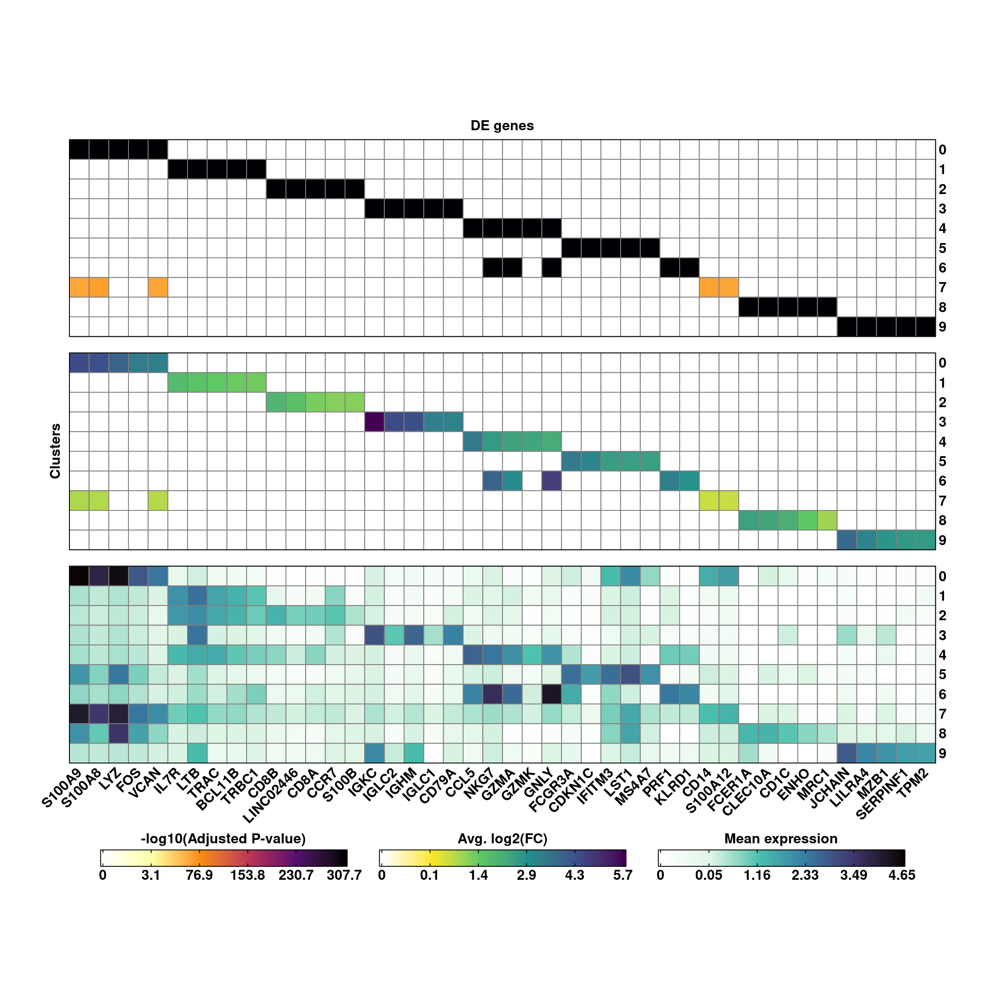
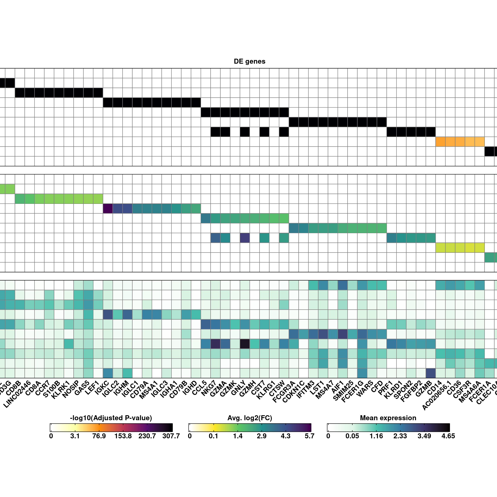
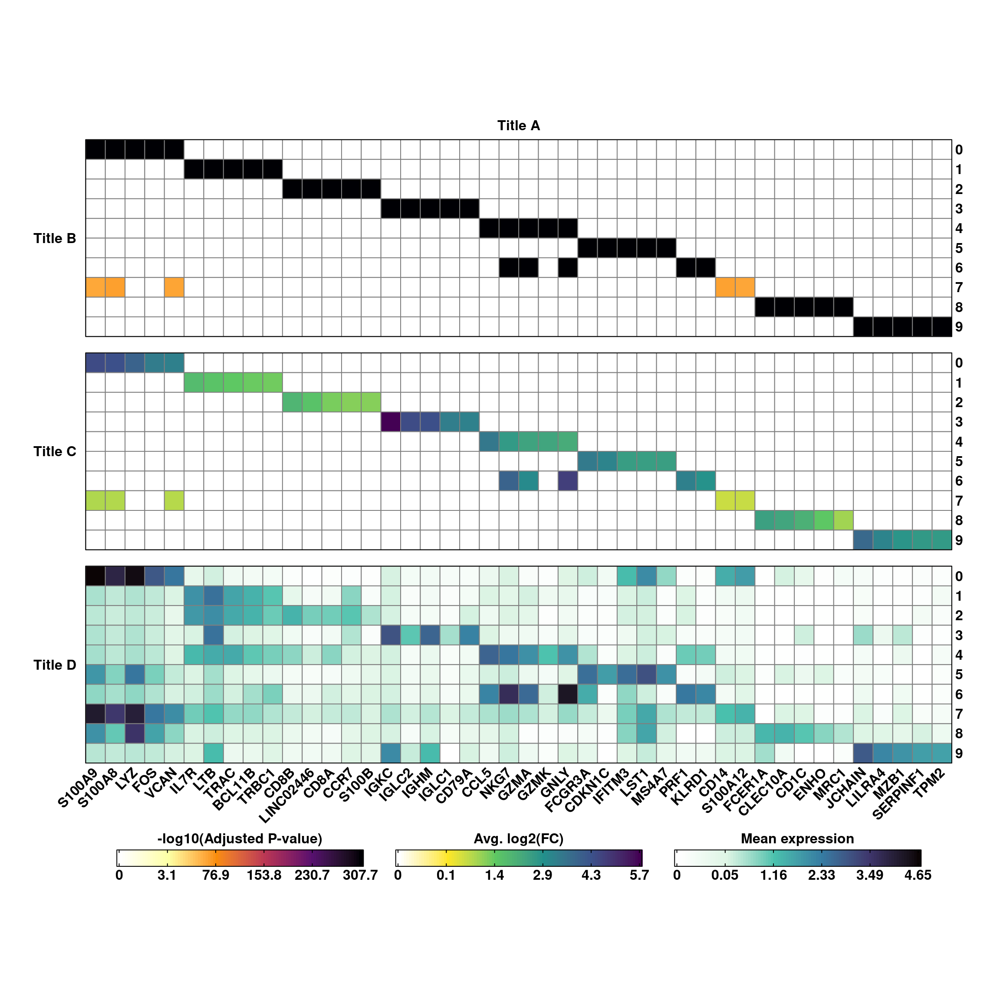
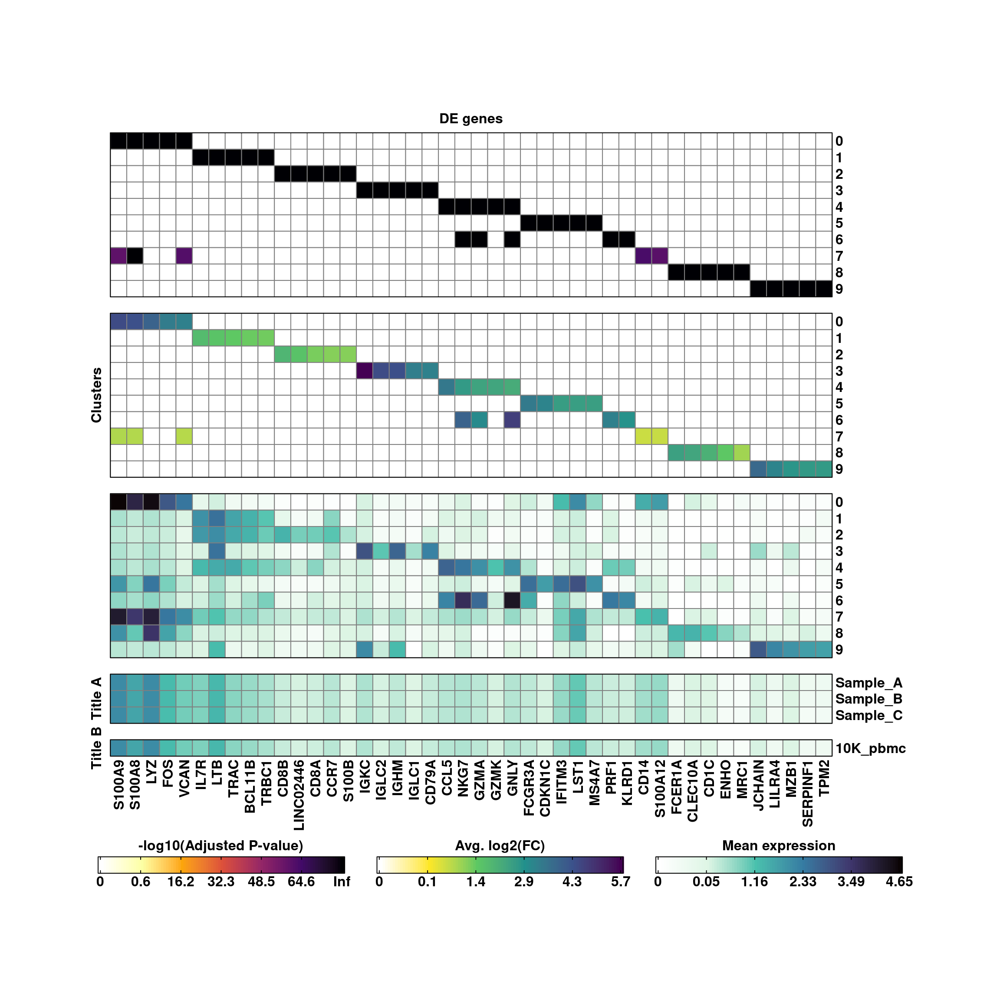
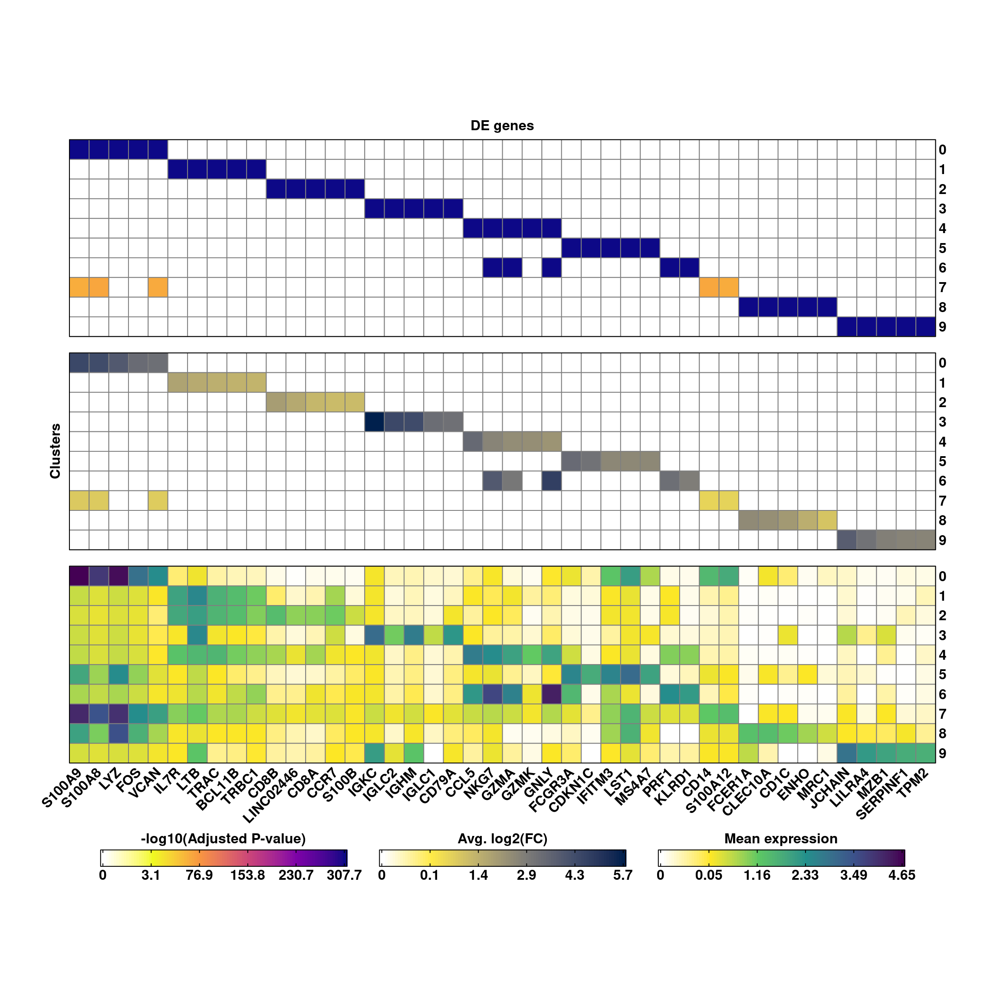

# Group-wise DE analysis plots

A common analysis that can be performed on SC data is a group-wise DE analysis. This is, for example, we want to compute the differentially expressed (DE) genes between each of our cell clusters vs the rest of the clusters. This yields a data frame in which we have the DE genes between each of the comparisons, that we can then use for visualization purposes, such as heatmaps. This process is implemented in `SCpubr::do_GroupwiseDEPlot()`. For this, we will need to provide the function a Seurat object and the output of the following command: 


```r
# Seurat sample.
sample <- your_seurat_object

# Set the identities correctly.
Seurat::Idents(sample) <- sample$seurat_clusters

# Compute DE genes and transform to a tibble.
de_genes <- tibble::tibble(Seurat::FindAllMarkers(object = sample))
```

This is the basic output of the function:


```r
# Default output.
p <- SCpubr::do_GroupwiseDEPlot(sample = sample,
                                de_genes = de_genes)

p
```

<div class="figure" style="text-align: center">

<p class="caption">(\#fig:unnamed-chunk-3)SCpubr do_GroupwiseDEPlot default output.</p>
</div>

By default, this computes three different heatmaps, all showing the top 5 DE genes for each of the clusters or groups for which we computed the DE genes, and their respective adjusted p-values (- log10), fold change (FC, log2) and mean expression by the groups. Genes are ordered based on the order of the groups. Therefore, these heatmaps have no hierarchical clustering in neither rows or columns. 

## Increase the number of genes

The number of top DE genes by cluster can be increased or reduced by using `top_genes`.


```r
# Increase the number of top DE genes by cluster.
p <- SCpubr::do_GroupwiseDEPlot(sample = sample,
                                de_genes = de_genes,
                                top_genes = 10)

p
```

<div class="figure" style="text-align: center">

<p class="caption">(\#fig:unnamed-chunk-4)SCpubr do_GroupwiseDEPlot increasing the number of DE genes by cluster.</p>
</div>
## Modify the titles of the rows and columns
We can also modify the row titles of the other heatmap bodies with `row_title_p_values`, `row_title_expression`  and `row_title_logfc` and the column titles with `column_title` and the angle of rotation of the row titles with 


```r
# Modify the row and column titles and the rotation.
p <- SCpubr::do_GroupwiseDEPlot(sample = sample,
                                de_genes = de_genes,
                                column_title = "Title A",
                                row_title_p_values = "Title B",
                                row_title_logfc = "Title C",
                                row_title_expression = "Title D",
                                row_title_rot = 0)

p
```

<div class="figure" style="text-align: center">

<p class="caption">(\#fig:unnamed-chunk-5)SCpubr do_GroupwiseDEPlot with modified row and column titles.</p>
</div>
## Add further layers of mean expression

One can add more groupings to the heatmap of mean expression values by making use of `group.by` parameter, that is set to `seurat_clusters` by default. As they will surely be other groups different than the ones the DE genes were computed to, we need to provide as many row titles for the new heatmaps as values in `group.by`, even if it is empty characters.


```r
sample$modified_orig.ident <- sample(x = c("Sample_A", "Sample_B", "Sample_C"), 
                                     size = ncol(sample), 
                                     replace = TRUE, 
                                     prob = c(0.2, 0.7, 0.1))

# Add more layers of mean expression with group.by.
p <- SCpubr::do_GroupwiseDEPlot(sample = sample,
                                de_genes = de_genes,
                                group.by = c("seurat_clusters", 
                                             "modified_orig.ident", 
                                             "orig.ident"),
                                row_title_expression = c("",
                                                         "Title A",
                                                         "Title B"))

p
```

<div class="figure" style="text-align: center">

<p class="caption">(\#fig:unnamed-chunk-6)SCpubr do_GroupwiseDEPlot with multiple layers of mean expression.</p>
</div>
This can be useful if we have different groupings we want to inspect at the same time. Also, the color scale is shared by all expression heatmaps. 

## Modify color scales

We can modify the color scales for each of the three main types of heatmaps with `viridis_map_pvalues`, `viridis_map_logfc` and `viridis_map_expression`, and providing a letter corresponding to a color scale.


```r
# Change the viridis scales.
p <- SCpubr::do_GroupwiseDEPlot(sample = sample,
                                de_genes = de_genes,
                                viridis_map_pvalues = "C",
                                viridis_map_logfc = "E",
                                viridis_map_expression = "D")

p
```

<div class="figure" style="text-align: center">

<p class="caption">(\#fig:unnamed-chunk-7)SCpubr do_GroupwiseDEPlot with other viridis scales.</p>
</div>
