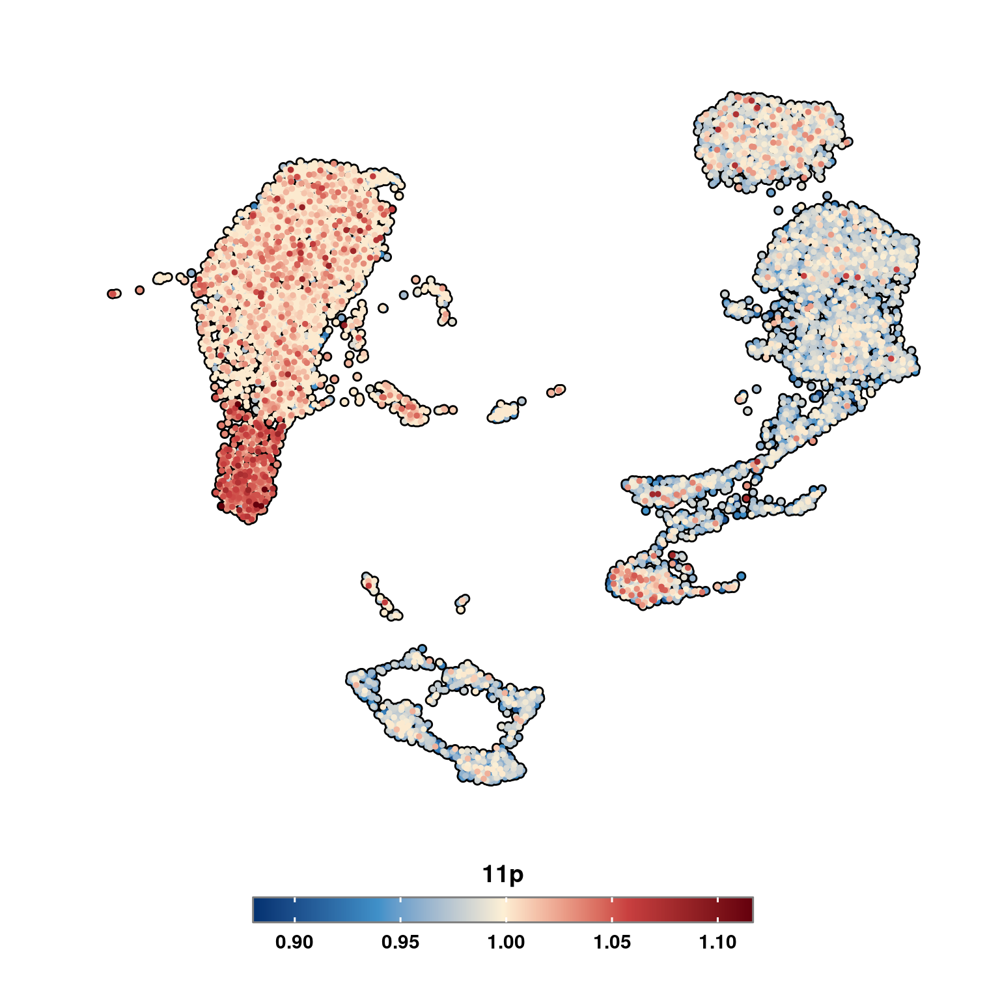
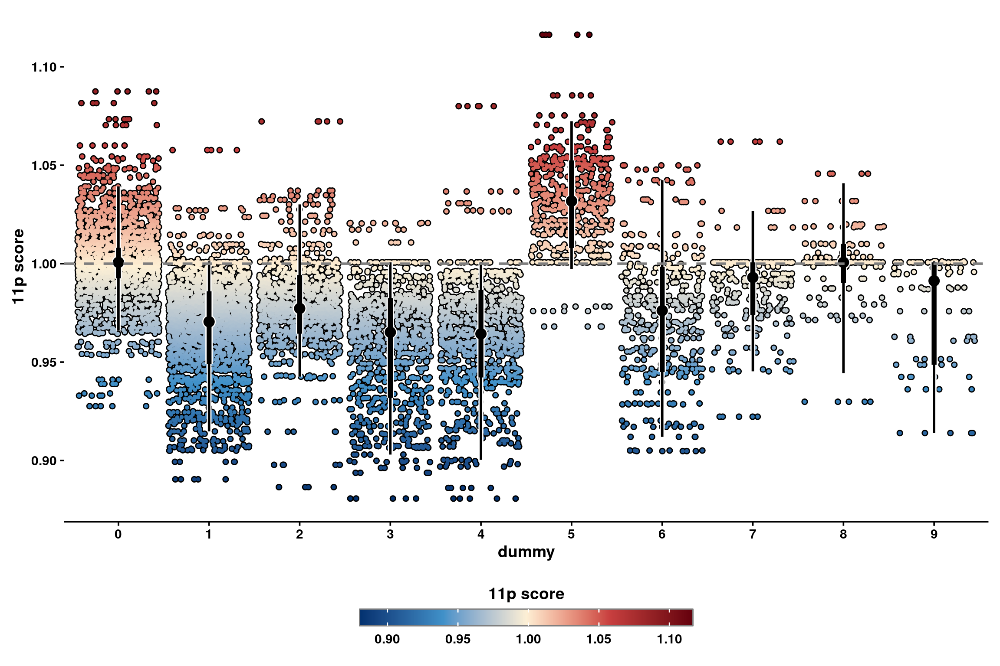
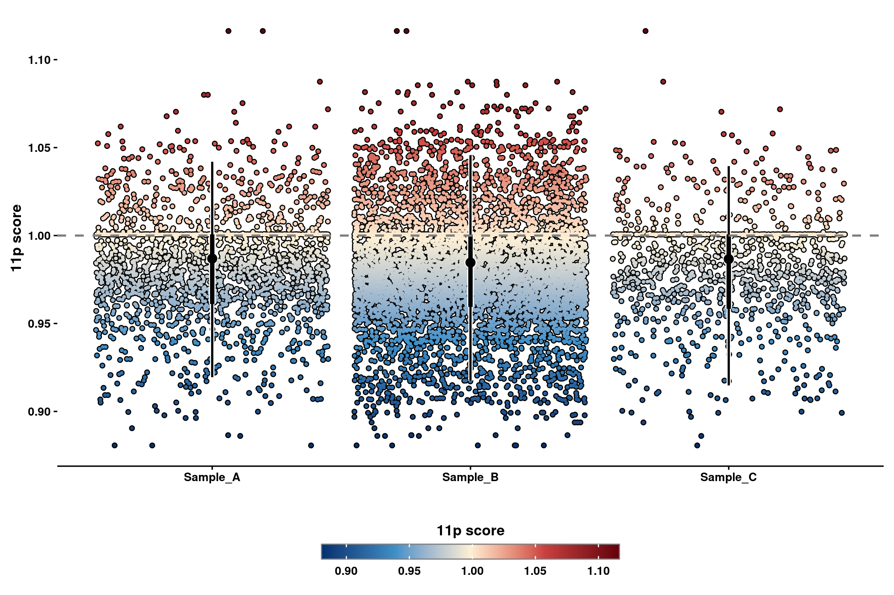
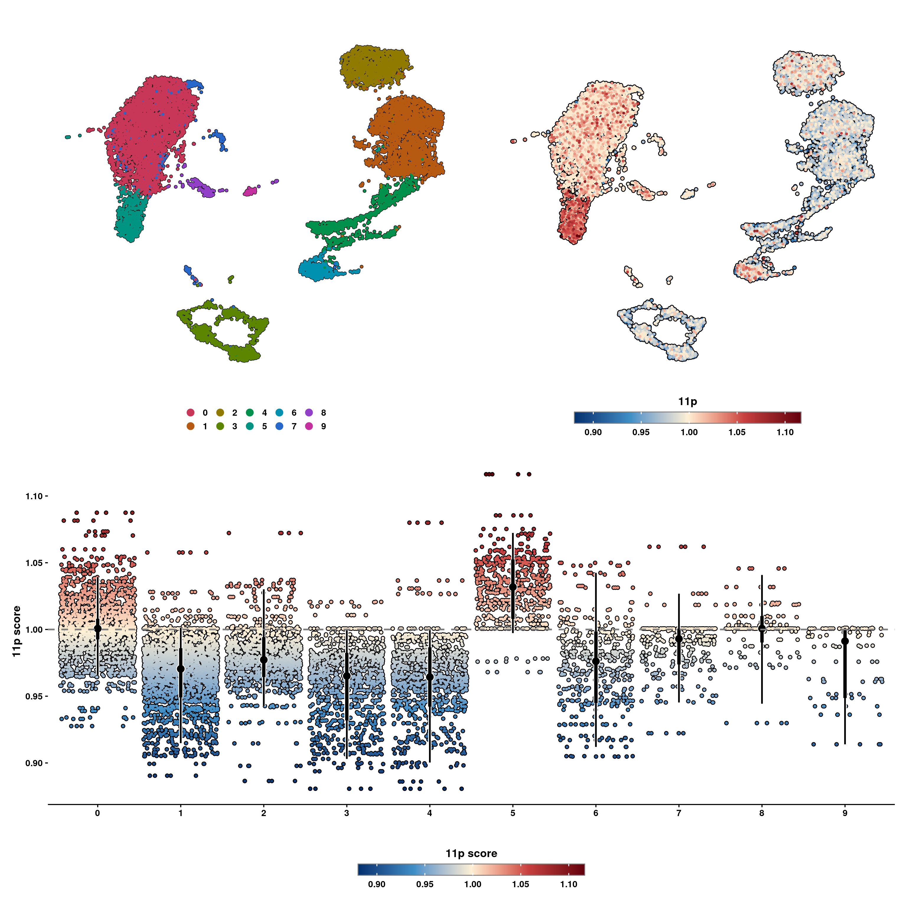

# Copy Number Variant analysis plots


Copy Number Variant analysis are another of the common analysis that one can compute on single-cell transcriptomics data. Provided with a reference one can compute, for the rest of the cells, whether there are Copy Number Variations (CNVs) in the cells across the chromosomes. This comes really handy to distinguish between tumor and healthy cells, provided that one has a CNV reference event to rely on. There are many tools to compute such analysis, but one that is highly used and that will be covered in this section is [inferCNV](https://github.com/broadinstitute/infercnv). 

InferCNV returns many outputs. The most interesting and straightforward one is the final image, such as the one below:
<span class="border-0"></span>

In it, we can observe that, for the different clusters, regions called as chromosome gains are colored as red and regions called as chromosome losses are colored as blue. This image, in the end, is a heatmap, meaning that there is, in the output of inferCNV, a matrix with the scores for each cell and gene, that we can make use of. This object is called, by default, *run.final.infercnv_obj*. This is the one that we will use.

## Transferring the scores to a FeaturePlot.

One of the cool things we can do with this object, is to transfer the inferCNV scores back to our Seurat object and then plot them as a FeaturePlot. This can be achieved with the function `SCpubr::do_CopyNumberVariantPlot()`. For this function, one needs to provide the Seurat object and the final inferCNV object, together with the chromosome locations. If metacells were computed (not necessary, but used in this example), the mapping of cell-metacell has to be provided as well:


```r
# This loads "human_chr_locations" into the environment.
utils::data("human_chr_locations", package = "SCpubr")

out <- SCpubr::do_CopyNumberVariantPlot(sample = sample,
                                        infercnv_object = infercnv_object,
                                        using_metacells = T,
                                        metacell_mapping = sample$metacell_mapping,
                                        chromosome_locations = human_chr_locations)
p <- out$`11p_umap`
p
```

<div class="figure" style="text-align: center">

<p class="caption">(\#fig:unnamed-chunk-2)SCpubr::do_CopyNumberVariantPlot FeaturePlot.</p>
</div>

Scores of 1 mean no chromosome gain or loss. Higher than one mean gain and lower mean loss. The function automatically computes the plots for *all chromosome regions*. If we want to restrict the output to a single chromosome, we can do so by stating it in `chromosome_focus` parameter.


```r
out <- SCpubr::do_CopyNumberVariantPlot(sample = sample,
                                        infercnv_object = infercnv_object,
                                        using_metacells = T,
                                        metacell_mapping = sample$metacell_mapping,
                                        chromosome_locations = human_chr_locations,
                                        chromosome_focus = "11")

```


## Plotting the scores grouped by a group of interest.

Sometimes, however, the FeaturePlot is not sufficient to get the insights we want from these scores. For this, the output of `SCpubr::do_CopyNumberVariantPlot()` also contains another set of Geyser plots, that showcase the distribution of scores per cells, grouped by a variable of interest.


```r
out <- SCpubr::do_CopyNumberVariantPlot(sample = sample,
                                        infercnv_object = infercnv_object,
                                        using_metacells = T,
                                        metacell_mapping = sample$metacell_mapping,
                                        chromosome_locations = human_chr_locations,
                                        chromosome_focus = "11",
                                        rotate_x_axis_labels = FALSE)
p <- out$`11p_geyser`
p
```

<div class="figure" style="text-align: center">

<p class="caption">(\#fig:unnamed-chunk-4)SCpubr::do_CopyNumberVariantPlot dot plot.</p>
</div>

Here, we can observe the scores for the different groups, being each dot a cells. Due to the overplotting, we also report the distribution of the data for each group in the center, being the dot the median of the distribution, the thicker lines representing the 66% of the data and the thinner lines the 95%. This way, one can also see where the majority of the cells reside in each group. We can also select other variables to group by.


```r
sample$modified_orig.ident <- sample(x = c("Sample_A", "Sample_B", "Sample_C"), 
                                     size = ncol(sample), 
                                     replace = T, 
                                     prob = c(0.2, 0.7, 0.1))

out <- SCpubr::do_CopyNumberVariantPlot(sample = sample,
                                        infercnv_object = infercnv_object,
                                        using_metacells = T,
                                        group.by = "modified_orig.ident",
                                        metacell_mapping = sample$metacell_mapping,
                                        chromosome_locations = human_chr_locations,
                                        chromosome_focus = "11",
                                        rotate_x_axis_labels = FALSE)
p <- out$`11p_geyser`
p
```

<div class="figure" style="text-align: center">

<p class="caption">(\#fig:unnamed-chunk-5)SCpubr::do_CopyNumberVariantPlot dot plot.</p>
</div>


## Joint analysis.

The ideal use case for such functions is to plot them side by side with a regular UMAP as well:


```r

p1 <- SCpubr::do_DimPlot(sample = sample,
                         plot_cell_borders = TRUE,
                         border.size = 1.5,
                         pt.size = 1)
out <- SCpubr::do_CopyNumberVariantPlot(sample = sample,
                                        infercnv_object = infercnv_object,
                                        using_metacells = T,
                                        metacell_mapping = sample$metacell_mapping,
                                        chromosome_locations = human_chr_locations,
                                        chromosome_focus = "11",
                                        rotate_x_axis_labels = FALSE)
p2 <- out$`11p_umap`
p3 <- out$`11p_geyser`

p <- (p1 | p2) / p3
p
```

<div class="figure" style="text-align: center">

<p class="caption">(\#fig:unnamed-chunk-6)SCpubr::do_CopyNumberVariantPlot joint analysis.</p>
</div>

This way, we can see which clusters are in the UMAP, see their scores and also visualize the distributions!

