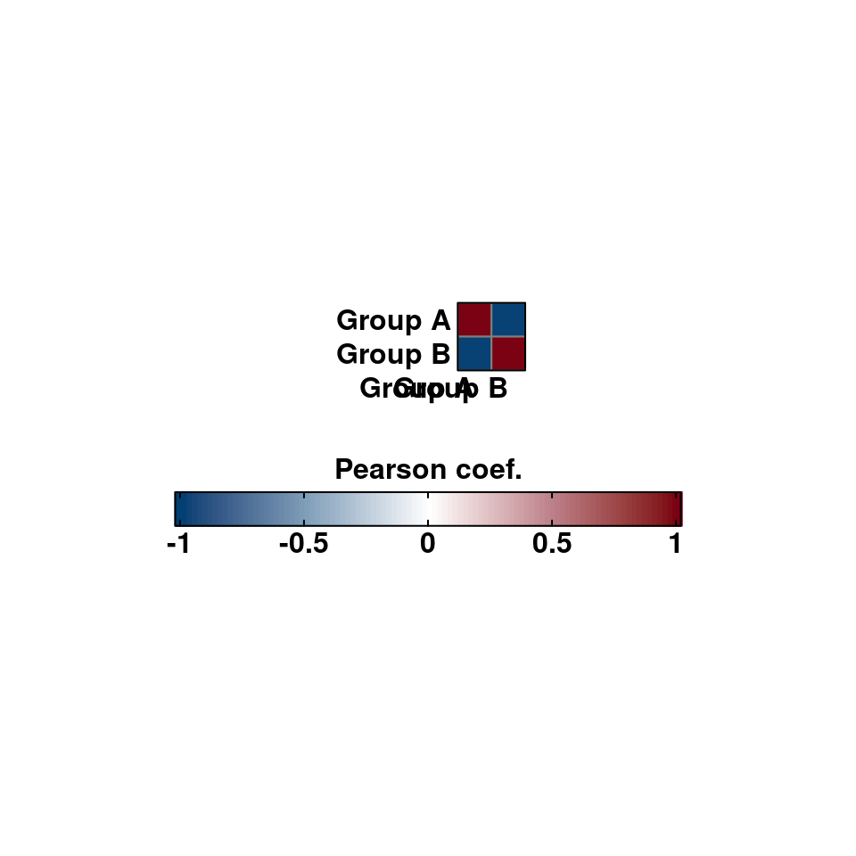
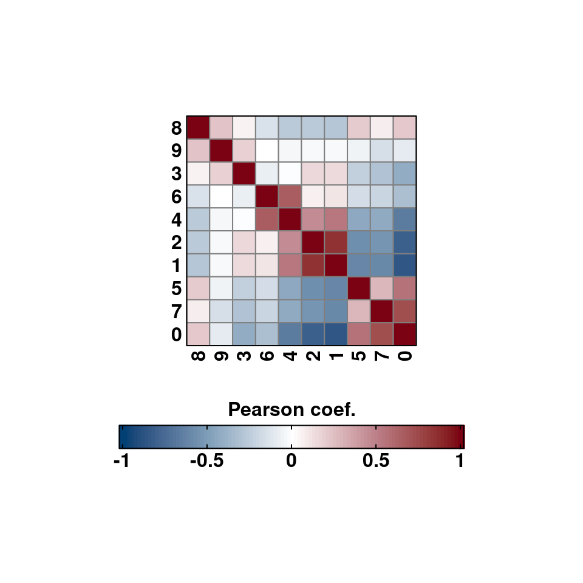
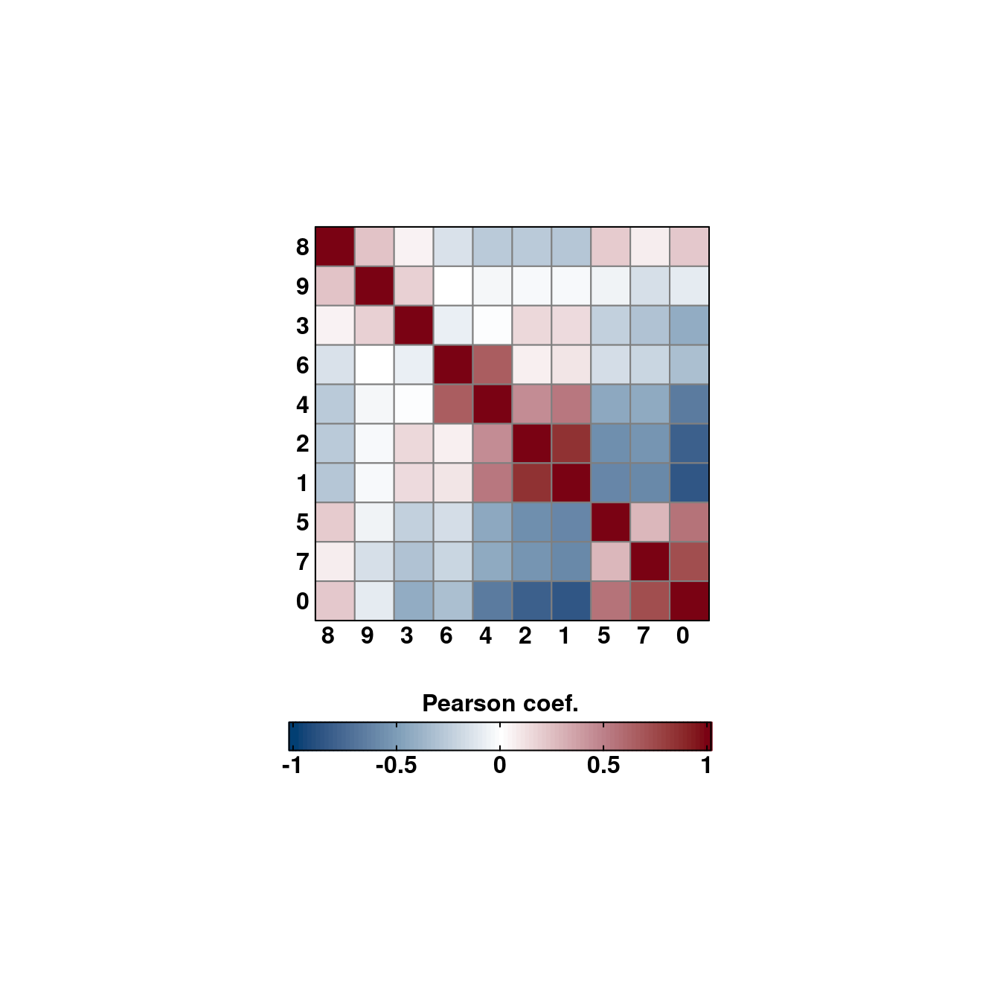

# Correlation matrix heatmaps

A common analysis to perform with your single cell data is to assess how much different subsets of your data are correlated between them. For this, correlation matrices are used, typically displayed as heatmaps. This is implemented in `SCpubr::do_CorrelationPlot()`. Right now, it only works for a single use case: computing the correlation matrix of the highly variable genes between the desired groups. Further use cases will be implemented in the future.


## Using Highly Variable Genes


```r
# Default values.
p <- SCpubr::do_CorrelationPlot(sample = sample)
p
```

<div class="figure" style="text-align: center">

<p class="caption">(\#fig:unnamed-chunk-2)SCpubr::do_CorrelationPlot with default parameters.</p>
</div>
By default, it computes the correlation over the current identities in the object. This can be changed by providing another metadata variable to `group.by`. 


```r
# Custom grouping.
sample$custom_group <- ifelse(sample$seurat_clusters %in% c("1", "3", "5", "7", "9"), "Group A", "Group B")
p <- SCpubr::do_CorrelationPlot(sample = sample, group.by = "custom_group")
p
```

<div class="figure" style="text-align: center">

<p class="caption">(\#fig:unnamed-chunk-3)SCpubr::do_CorrelationPlot with custom grouping.</p>
</div>

Axes labels can also be rotated.


```r
# Rotated axis labels.
p <- SCpubr::do_CorrelationPlot(sample = sample,
                                column_names_rot = 90)
p
```

<div class="figure" style="text-align: center">

<p class="caption">(\#fig:unnamed-chunk-4)SCpubr::do_CorrelationPlot with rotated axis labels.</p>
</div>
## Changing the cell size in the heatmap

Same as with Enrichment Heatmaps, the aspect ratio of the tiles in the heatmap is fixed so that cells are squares, and not rectangles. This can be changed modifying `cell_size` parameter. This is set to 5 by default.

```r
# Increase cell size.
p <- SCpubr::do_CorrelationPlot(sample = sample,
                                column_names_rot = 0,
                                cell_size = 7)
p
```

<div class="figure" style="text-align: center">

<p class="caption">(\#fig:unnamed-chunk-5)SCpubr::do_CorrelationPlot with rotated axis labels.</p>
</div>
