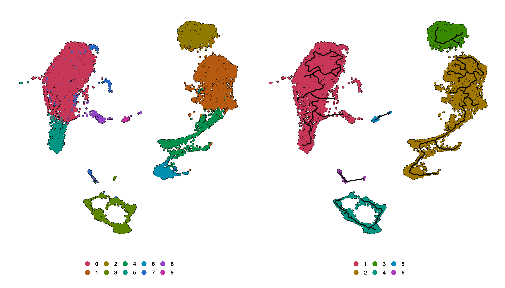
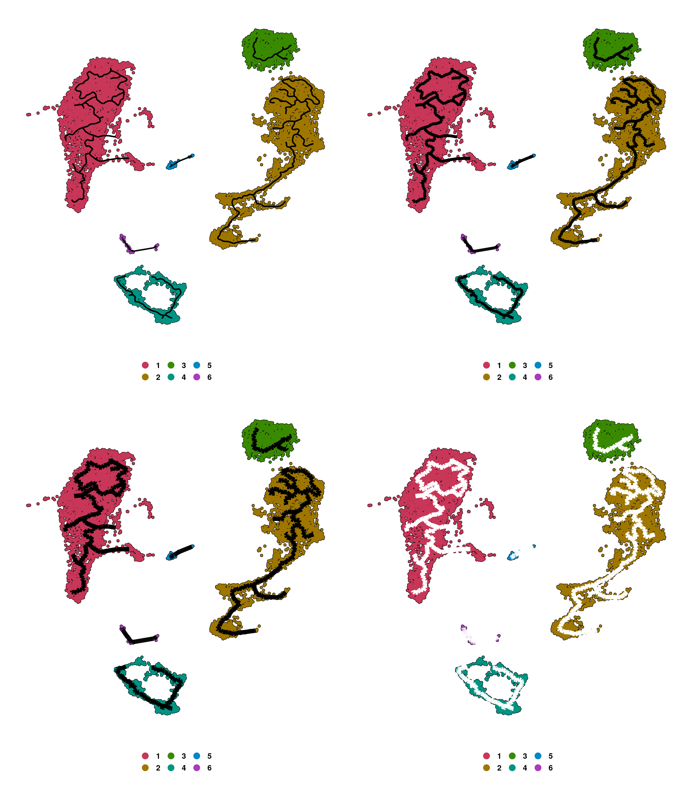
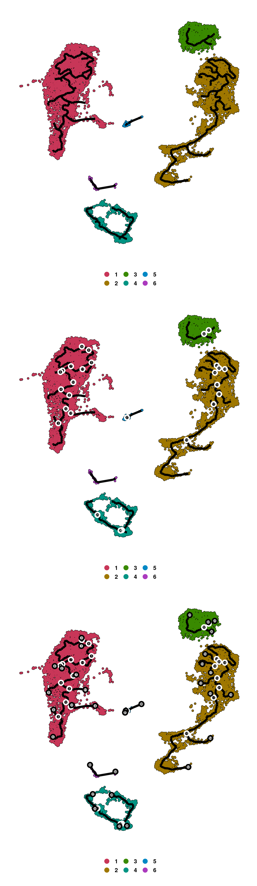
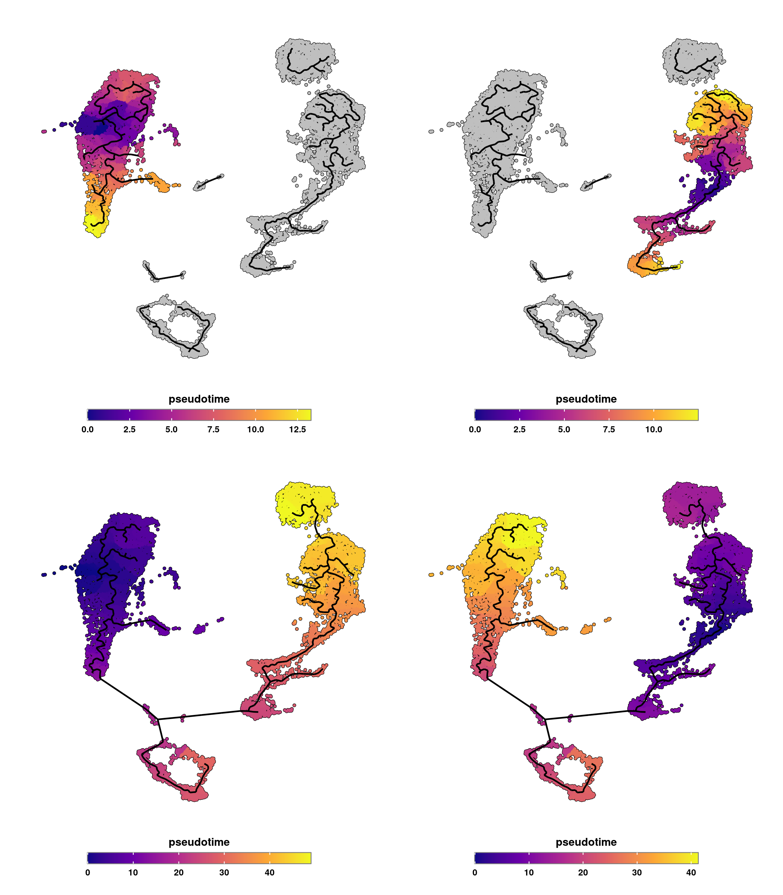
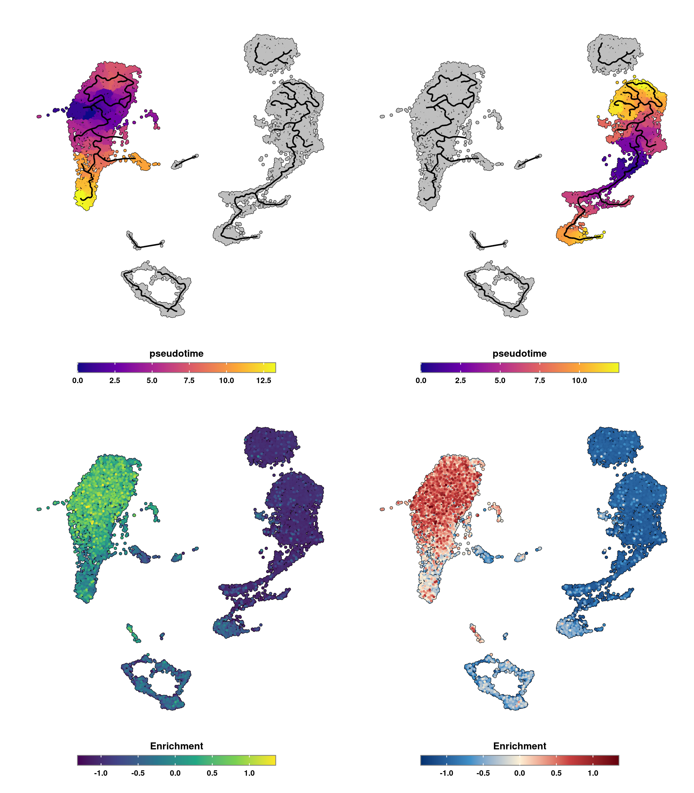

# Pseudotime analysis

Pseudotime analysis is, perhaps, one of the major analysis that can be carried out in SC data. It aims to depict a trajectory, a sort of order in which cells transition from A to B. What defines this process, and the starting and end point is **heavily** driven by the research question, the nature of the data and prior knowledge. While inferring this using data-driven approaches is possible, in `SCpubr` we will implement a prior-knowledge driven approach in a very specific use case.

For this, we will make use of [monocle3](https://cole-trapnell-lab.github.io/monocle3/). Out of the many uses of monocle3, we can infer a trajectory graph for the cells and, based on a list of marker genes, we can **order** the cells along this graph selecting either the cell with the highest or lowest enrichment score for the provided list of genes as starting point. For example:

*In a general sense, we are working with a data set for which a given biological phenotype is expected. For this phenotype, we do have a list of genes that accurately characterize this process. The process needs to be of a differentiation kind, meaning that cells will transition based on this list of genes between state A and state B. Once these conditions are met, we can make use of the trajectory graph alongside enrichment scores for the cells in the list of genes. Depending whether this list of genes depict the start of the end of the process, we can use the cell with the highest or lowest enrichment scores as the starting point of the differentiation trajectory, ordering the rest of the cells based on that and computing the associated pseudotime.*

Of course, selecting the one cell with the highest or lowest enrichment scores might be a *simplistic* approach, as this elevated or low enrichment score might be due to technical bias. In order to correct this a bit, we first select the cluster (or selected group) that, in average, has the highest or lowest mean enrichment score and from this cluster we select the cell with the highest or lowest score, accordingly.

Having this clear, again, we would like to remark that this is a very specific use case of this analysis and much more can be done using monocle3. Please have a look at their [vignette](https://cole-trapnell-lab.github.io/monocle3/docs/trajectories/) for more information about pseudotime analysis. For our specific use case, `SCpubr::do_PseudotimePlot()` can be used.

## Setting up partitions and clusters.

For this function to work, we need a Seurat object together with a Cell Data Set (CDS) object, that needs to be generated by `SeuratWrappers::as.cell_data_set()`.

First thing to take into account is that monocle3 computes *partitions* and *clusters*. This is, when cells are too far away, the trajectory is disconnected, generating partitions with different start and end trajectories. We can tweak this process by forcing all of our data to be in a single partition or to keep as identities the group that we desire. This can be done by using `compute_monocle_partitions` and `compute_monocle_clusters` parameters.


We will use the following genes as a example, that depict CD14+ mono cells.


```r
# Genes to use.
pseudotime_genes <- c("CD14", "LYN")
```


```r
# Define your sample.
sample <- your_seurat_object
# Transform into CDS.
cds <- SeuratWrappers::as.cell_data_set(sample)

# Compute monocle clusters and partitions.
out <- SCpubr::do_PseudotimePlot(sample = sample,
                                 cds = cds,
                                 compute_monocle_partitions = TRUE,
                                 compute_monocle_clusters = TRUE,
                                 pseudotime_genes = pseudotime_genes)

# Compute monocle clusters and keep a single partition.
out <- SCpubr::do_PseudotimePlot(sample = sample,
                                 cds = cds,
                                 compute_monocle_partitions = FALSE,
                                 compute_monocle_clusters = TRUE,
                                 pseudotime_genes = pseudotime_genes)

# Compute monocle partitions but keep original identities as clusters.
out <- SCpubr::do_PseudotimePlot(sample = sample,
                                 cds = cds,
                                 compute_monocle_partitions = TRUE,
                                 compute_monocle_clusters = FALSE,
                                 pseudotime_genes = pseudotime_genes)

# Keep original identities as clusters and a single partition.
out <- SCpubr::do_PseudotimePlot(sample = sample,
                                 cds = cds,
                                 compute_monocle_partitions = FALSE,
                                 compute_monocle_clusters = FALSE,
                                 pseudotime_genes = pseudotime_genes)

# Set a metadata varible as clusters and a single partition.
out <- SCpubr::do_PseudotimePlot(sample = sample,
                                 cds = cds,
                                 compute_monocle_partitions = FALSE,
                                 compute_monocle_clusters = FALSE,
                                 group.by = "orig.ident")
```

## Visualizing the trajectory graph.


```r
# Compute trajectory graph.
out <- SCpubr::do_PseudotimePlot(sample = sample,
                                 cds = cds,
                                 compute_monocle_partitions = TRUE,
                                 compute_monocle_clusters = FALSE,
                                 pseudotime_genes = pseudotime_genes)
# Retrieve trajectory groups.
p1 <- out$trajectory_groups
# Retrieve trajectory partitions.
p2 <- out$trajectory_partitions

p <- p1 | p2
p
```

<div class="figure" style="text-align: center">

<p class="caption">(\#fig:unnamed-chunk-4)SCpubr do_PseudotimePlot trajectory graph output.</p>
</div>

We can increase the trajectory graph width by using `trajectory_graph_segment_size` and the color with `trajectory_graph_color` parameters.


```r
# Change trajectory graph width.
out <- SCpubr::do_PseudotimePlot(sample = sample,
                                 cds = cds,
                                 compute_monocle_partitions = TRUE,
                                 compute_monocle_clusters = FALSE,
                                 pseudotime_genes = pseudotime_genes,
                                 trajectory_graph_segment_size = 1)
p1 <- out$trajectory_partitions

out <- SCpubr::do_PseudotimePlot(sample = sample,
                                 cds = cds,
                                 compute_monocle_partitions = TRUE,
                                 compute_monocle_clusters = FALSE,
                                 pseudotime_genes = pseudotime_genes,
                                 trajectory_graph_segment_size = 2)
p2 <- out$trajectory_partitions

out <- SCpubr::do_PseudotimePlot(sample = sample,
                                 cds = cds,
                                 compute_monocle_partitions = TRUE,
                                 compute_monocle_clusters = FALSE,
                                 pseudotime_genes = pseudotime_genes,
                                 trajectory_graph_segment_size = 3)
p3 <- out$trajectory_partitions


out <- SCpubr::do_PseudotimePlot(sample = sample,
                                 cds = cds,
                                 compute_monocle_partitions = TRUE,
                                 compute_monocle_clusters = FALSE,
                                 pseudotime_genes = pseudotime_genes,
                                 trajectory_graph_segment_size = 3,
                                 trajectory_graph_color = "white")
p4 <- out$trajectory_partitions

p <- (p1 | p2) / (p3 | p4)
p
```

<div class="figure" style="text-align: center">

<p class="caption">(\#fig:unnamed-chunk-5)SCpubr do_PseudotimePlot trajectory graph with different widths and color.</p>
</div>

We can also add different elements to the graph, such as the roots, branches and leaves with


```r
# Add nodes, branches and leaves to the trajectory graph.
out <- SCpubr::do_PseudotimePlot(sample = sample,
                                 cds = cds,
                                 compute_monocle_partitions = TRUE,
                                 compute_monocle_clusters = FALSE,
                                 pseudotime_genes = pseudotime_genes,
                                 trajectory_graph_segment_size = 2,
                                 label_roots = TRUE)
p1 <- out$trajectory_partitions

out <- SCpubr::do_PseudotimePlot(sample = sample,
                                 cds = cds,
                                 compute_monocle_partitions = TRUE,
                                 compute_monocle_clusters = FALSE,
                                 pseudotime_genes = pseudotime_genes,
                                 trajectory_graph_segment_size = 2,
                                 label_roots = TRUE,
                                 label_branches = TRUE)
p2 <- out$trajectory_partitions


out <- SCpubr::do_PseudotimePlot(sample = sample,
                                 cds = cds,
                                 compute_monocle_partitions = TRUE,
                                 compute_monocle_clusters = FALSE,
                                 pseudotime_genes = pseudotime_genes,
                                 trajectory_graph_segment_size = 2,
                                 label_roots = TRUE,
                                 label_branches = TRUE,
                                 label_leaves = TRUE)
p3 <- out$trajectory_partitions

p <- p1 / p2 / p3
p
```

<div class="figure" style="text-align: center">

<p class="caption">(\#fig:unnamed-chunk-6)SCpubr do_PseudotimePlot trajectory graph with roots, branches and leaves.</p>
</div>

## Visualizing the pseudotime.

We can inspect the pseudotime by providing whether the root of the trajectory is the highest or lowest enrichment score, with `is_max_score_the_start` parameter.


```r
# Plot pseudotime with monocle partitions using highest score as root.
out <- SCpubr::do_PseudotimePlot(sample = sample,
                                 cds = cds,
                                 compute_monocle_partitions = TRUE,
                                 compute_monocle_clusters = FALSE,
                                 pseudotime_genes = pseudotime_genes,
                                 is_max_score_the_start = TRUE)
p1 <- out$pseudotime

# Plot pseudotime with monocle partitions using lowest score as root.
out <- SCpubr::do_PseudotimePlot(sample = sample,
                                 cds = cds,
                                 compute_monocle_partitions = TRUE,
                                 compute_monocle_clusters = FALSE,
                                 pseudotime_genes = pseudotime_genes,
                                 is_max_score_the_start = FALSE)
p2 <- out$pseudotime


# Plot pseudotime with monocle partitions using highest score as root.
out <- SCpubr::do_PseudotimePlot(sample = sample,
                                 cds = cds,
                                 compute_monocle_partitions = FALSE,
                                 compute_monocle_clusters = FALSE,
                                 pseudotime_genes = pseudotime_genes,
                                 is_max_score_the_start = TRUE)
p3 <- out$pseudotime

# Plot pseudotime with monocle partitions using lowest score as root.
out <- SCpubr::do_PseudotimePlot(sample = sample,
                                 cds = cds,
                                 compute_monocle_partitions = FALSE,
                                 compute_monocle_clusters = FALSE,
                                 pseudotime_genes = pseudotime_genes,
                                 is_max_score_the_start = FALSE)
p4 <- out$pseudotime

p <- (p1 | p2) / (p3 | p4)
p
```

<div class="figure" style="text-align: center">

<p class="caption">(\#fig:unnamed-chunk-7)SCpubr do_PseudotimePlot pseudotime output with different ordering.</p>
</div>

As can be observed, if we compute different partitions, the one used will be the one that contains the highest or lowest enrichment score, up to our choice. If not, the whole trajectory for the whole UMAP will be used, providing very different results. The key to this is the kind of sample/cds we provide as input (i.e, if we have a tumor bulk that we want to keep as a single partition or not or similar).

We can also visualize the enrichment scores as a feature plot alongside the pseudotime, either in a symmetrical scale or not with `symmetrical_scale`.


```r
# Plot pseudotime with monocle partitions using highest score as root.
out <- SCpubr::do_PseudotimePlot(sample = sample,
                                 cds = cds,
                                 compute_monocle_partitions = TRUE,
                                 compute_monocle_clusters = FALSE,
                                 pseudotime_genes = pseudotime_genes,
                                 symmetrical_scale = FALSE,
                                 is_max_score_the_start = TRUE)
p1 <- out$pseudotime
p3 <- out$enrichment
# Plot pseudotime with monocle partitions using lowest score as root.
out <- SCpubr::do_PseudotimePlot(sample = sample,
                                 cds = cds,
                                 compute_monocle_partitions = TRUE,
                                 compute_monocle_clusters = FALSE,
                                 pseudotime_genes = pseudotime_genes,
                                 symmetrical_scale = TRUE,
                                 is_max_score_the_start = FALSE)
p2 <- out$pseudotime
p4 <- out$enrichment

p <- (p1 | p2) / (p3 | p4)
p
```

<div class="figure" style="text-align: center">

<p class="caption">(\#fig:unnamed-chunk-8)SCpubr do_PseudotimePlot pseudotime output with enrichment scores.</p>
</div>
