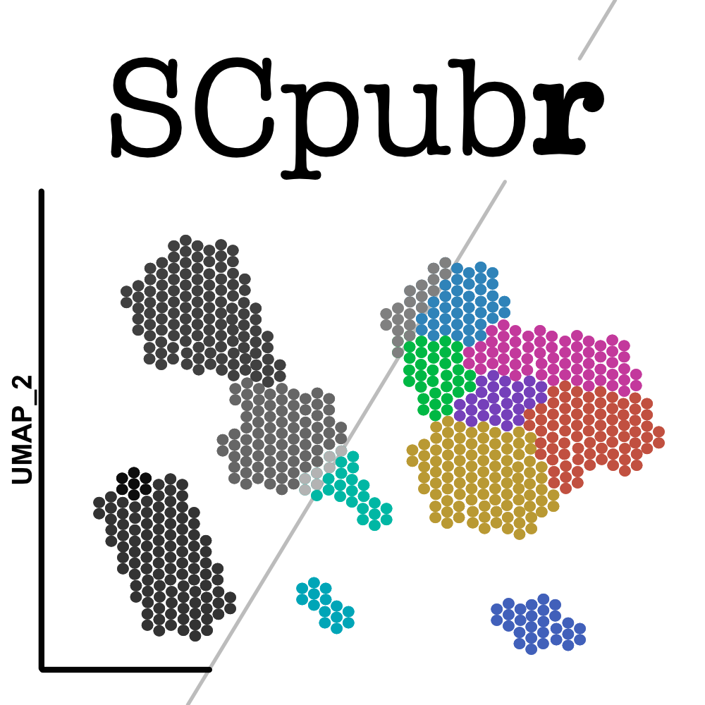

--- 
title: "SCpubr"
author: "Enrique Blanco Carmona"
date: "21 February, 2022"
site: bookdown::bookdown_site
documentclass: book
bibliography: [book.bib]
url: https://enblacar.github.io/SCpubr-book/
github-repo: enblacar/SCpubr-book/
cover-image: images/SCpubr_logo.png
description: |
  Collection of functions aimed to streamline quality figure generation for Single Cell transcriptomics experiments.
biblio-style: apalike
csl: chicago-fullnote-bibliography.csl
---
# About this package {-}

This package aims to provide a streamlined way of generating publication ready figures for known single-cell visualizations. As subjective as the term "aesthetically pleasant" can be, this a set of theme modifications implemented across different plot types. This package also serves as a personal project, with future prospects of growth.

